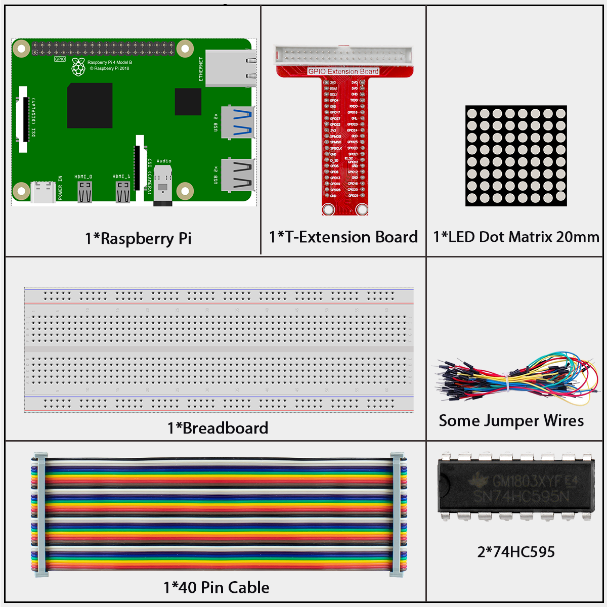
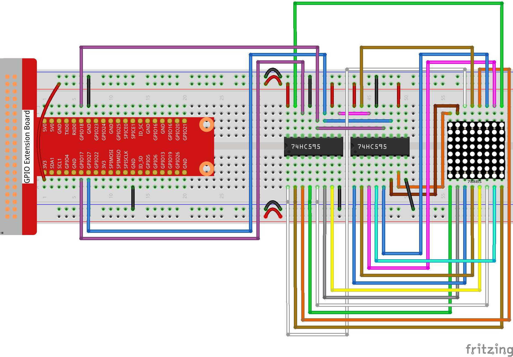

# 1.1.3 LED Dot Matrix

## Introduction

As the name suggests, an LED dot matrix is a matrix composed of LEDs. The lighting up and dimming of the LEDs formulate different characters and patterns.

## Components



**LED Dot Matrix**

Generally, LED dot matrix can be categorized into two types: common cathode (CC) and common anode (CA). They look much alike, but internally the difference lies. You can tell by test. A CA one is used in this kit. You can see 788BS labeled at the side. 

See the figure below. The pins are arranged at the two ends at the back. Take the label side for reference: pins on this end are pin 1-8, and oh the other are pin 9-16.

The external view:


Below the figures show their internal structure. You can see in a CA LED dot matrix, ROW represents the anode of the LED, and COL is cathode; it’s contrary for a CC one. One thing in common: for both types, pin 13, 3, 4, 10, 6, 11, 15, and 16 are all COL, when pin 9, 14, 8, 12, 1, 7, 2, and 5 are all ROW. If you want to turn on the first LED at the top left corner, for a CA LED dot matrix, just set pin 9 as High and pin 13 as Low, and for a CC one, set pin 13 as High and pin 9 as Low. If you want to light up the whole first column, for CA, set pin 13 as Low and ROW 9, 14, 8, 12, 1, 7, 2, and 5 as High, when for CC, set pin 13 as High and ROW 9, 14, 8, 12, 1, 7, 2, and 5 as Low. Consider the following figures for better understanding.

Pin numbering corresponding to the above rows and columns:

| **COL**     | **1**  | **2**  | **3** | **4**  | **5** | **6**  | **7**  | **8**  |
| ----------- | ------ | ------ | ----- | ------ | ----- | ------ | ------ | ------ |
| **Pin No.** | **13** | **3**  | **4** | **10** | **6** | **11** | **15** | **16** |
| **ROW**     | **1**  | **2**  | **3** | **4**  | **5** | **6**  | **7**  | **8**  |
| **Pin No.** | **9**  | **14** | **8** | **12** | **1** | **7**  | **2**  | **5**  |


## Connect

<div class="warning" style="background-color: #E7F2FA; color=#6AB0DE; padding: 10px; border: 1px solid #333; border-radius: 5px;">
    NOTE: In the Fritzing image above, the side with label is at the bottom.
</div>



## Code

### For  C  Language User

Go to the code folder compile and run.

```sh
cd ~/super-starter-kit-for-raspberry-pi/c/1.1.3/
gcc 1.1.3_LedMatrix.c -lwiringPi
sudo ./a.out
```

After the code runs, the LED dot matrix lights up and out row by row and column by column.

This is the complete code

```c
#include <wiringPi.h>
#include <stdio.h>

#define   SDI   0   //serial data input
#define   RCLK  1   //memory clock input(STCP)
#define   SRCLK 2   //shift register clock input(SHCP)

unsigned char code_H[20] = {0x01,0xff,0x80,0xff,0x01,0x02,0x04,0x08,0x10,0x20,0x40,0x80,0xff,0xff,0xff,0xff,0xff,0xff,0xff,0xff};
unsigned char code_L[20] = {0x00,0x7f,0x00,0xfe,0x00,0x00,0x00,0x00,0x00,0x00,0x00,0x00,0xfe,0xfd,0xfb,0xf7,0xef,0xdf,0xbf,0x7f};

void init(void){
   pinMode(SDI, OUTPUT);
   pinMode(RCLK, OUTPUT);
   pinMode(SRCLK, OUTPUT);

   digitalWrite(SDI, 0);
   digitalWrite(RCLK, 0);
   digitalWrite(SRCLK, 0);
}

void hc595_in(unsigned char dat){
   int i;
   for(i=0;i<8;i++){
      digitalWrite(SDI, 0x80 & (dat << i));
      digitalWrite(SRCLK, 1);
      delay(1);
      digitalWrite(SRCLK, 0);
   }
}

void hc595_out(){
   digitalWrite(RCLK, 1);
   delay(1);
   digitalWrite(RCLK, 0);
}

int main(void){
   int i;
   if(wiringPiSetup() == -1){ //when initialize wiring failed, print message to screen
      printf("setup wiringPi failed !");
      return 1;
   }
   init();
   while(1){
      for(i=0;i<sizeof(code_H);i++){
            hc595_in(code_L[i]);
            hc595_in(code_H[i]);
            hc595_out();
            delay(100);
      }

      for(i=sizeof(code_H);i>=0;i--){
            hc595_in(code_L[i]);
            hc595_in(code_H[i]);
            hc595_out();
            delay(100);
      }
   }

   return 0;
}
```

**For  Python  Language User**

Go to the code folder and run.

```sh
cd ~/super-starter-kit-for-raspberry-pi/python
python 1.1.3_LedMatrix.py
```

This is the complete code

```python
import RPi.GPIO as GPIO
import time

SDI   = 17
RCLK  = 18
SRCLK = 27

# we use BX matrix, ROW for anode, and COL for cathode
# ROW  ++++
code_H = [0x01,0xff,0x80,0xff,0x01,0x02,0x04,0x08,0x10,0x20,0x40,0x80,0xff,0xff,0xff,0xff,0xff,0xff,0xff,0xff]
# COL  ----
code_L = [0x00,0x7f,0x00,0xfe,0x00,0x00,0x00,0x00,0x00,0x00,0x00,0x00,0xfe,0xfd,0xfb,0xf7,0xef,0xdf,0xbf,0x7f]

def setup():
    GPIO.setmode(GPIO.BCM)    # Number GPIOs by its BCM location
    GPIO.setup(SDI, GPIO.OUT)
    GPIO.setup(RCLK, GPIO.OUT)
    GPIO.setup(SRCLK, GPIO.OUT)
    GPIO.output(SDI, GPIO.LOW)
    GPIO.output(RCLK, GPIO.LOW)
    GPIO.output(SRCLK, GPIO.LOW)

# Shift the data to 74HC595
def hc595_shift(dat):
    for bit in range(0, 8): 
        GPIO.output(SDI, 0x80 & (dat << bit))
        GPIO.output(SRCLK, GPIO.HIGH)
        time.sleep(0.001)
        GPIO.output(SRCLK, GPIO.LOW)
    GPIO.output(RCLK, GPIO.HIGH)
    time.sleep(0.001)
    GPIO.output(RCLK, GPIO.LOW)

def main():
    while True:
        for i in range(0, len(code_H)):
            hc595_shift(code_L[i])
            hc595_shift(code_H[i])
            time.sleep(0.1)

        for i in range(len(code_H)-1, -1, -1):
            hc595_shift(code_L[i])
            hc595_shift(code_H[i])
            time.sleep(0.1)

def destroy():
    GPIO.cleanup()

if __name__ == '__main__':
    setup()
    try:
        main()
    except KeyboardInterrupt:
        destroy()
```

After the code runs, the LED dot matrix lights up and out row by row and column by column.

## Phenomenon


