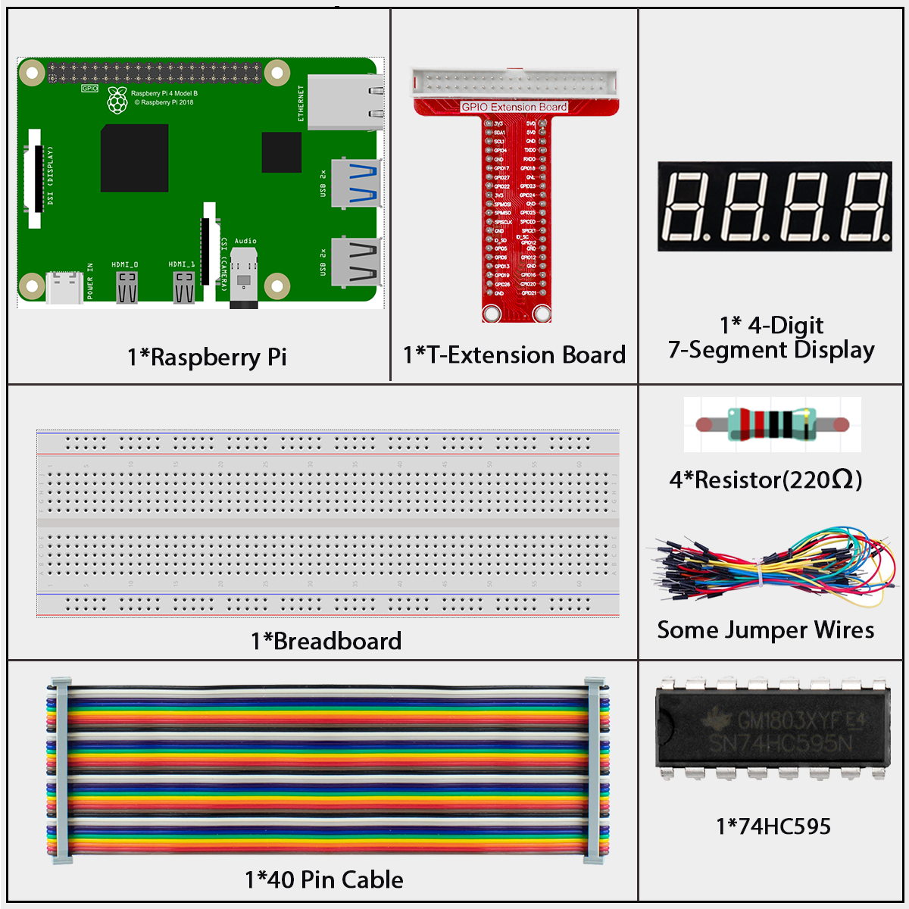

# 1.1.5 4-Digit 7-Segment Display

## Introduction

Next, follow me to try to control the 4-digit 7-segment display.

## Components



**4-Digit 7-Segment Display**

4-Digit 7-segment display consists of four 7- segment displays working together.


The 4-digtal 7-segment display works independently. It uses the principle of human visual persistence to quickly display the characters of each 7-segment in a loop to form continuous strings.

For example, when “1234” is displayed on the display, “1” is displayed on the first 7-segment, and “234” is not displayed. After a period of time, the second 7-segment shows “2”, the 1st 3th 4th of 7-segment does not show, and so on, the four digital display show in turn. This process is very short (typically 5ms), and because of the optical afterglow effect and the principle of visual residue, we can see four characters at the same time.


**Display Codes**

To help you get to know how 7-segment displays(Common Cathode) display Numbers, we have drawn the following table. Numbers are the number 0-F displayed on the 7-segment display; (DP) GFEDCBA refers to the corresponding LED set to 0 or 1, For example, 11000000 means that DP and G are set to 1, while others are set to 0. Therefore, the number 0 is displayed on the 7-segment display, while HEX Code corresponds to hexadecimal number.


| T-Board Name | physical | wiringPi | BCM  |
| ------------ | -------- | -------- | ---- |
| GPIO17       | Pin 11   | 0        | 17   |
| GPIO27       | Pin 13   | 2        | 27   |
| GPIO22       | Pin 15   | 3        | 22   |
| SPIMOSI      | Pin 19   | 12       | 10   |
| GPIO18       | Pin 12   | 1        | 18   |
| GPIO23       | Pin 16   | 4        | 23   |
| GPIO24       | Pin 18   | 5        | 24   |


## Connect


## Code

### For  C  Language User

Go to the code folder compile and run.

```sh
cd ~/davinci-kit-for-raspberry-pi/c/1.1.5/
gcc 1.1.5_4-Digit.c -lwiringPi
sudo ./a.out
```

This is the complete code

```c
#include <wiringPi.h>
#include <stdio.h>
#include <wiringShift.h>
#include <signal.h>
#include <unistd.h>

#define SDI 5
#define RCLK 4
#define SRCLK 1

const int placePin[] = {12, 3, 2, 0};
unsigned char number[] = {0x3f, 0x06, 0x5b, 0x4f, 0x66, 0x6d, 0x7d, 0x07, 0x7f, 0x6f};

int counter = 0;

void pickDigit(int digit)
{
    for (int i = 0; i < 4; i++)
    {
        digitalWrite(placePin[i], 1);
    }
    digitalWrite(placePin[digit], 0);
}

void hc595_shift(int8_t data)
{
    int i;
    for (i = 0; i < 8; i++)
    {
        digitalWrite(SDI, 0x80 & (data << i));
        digitalWrite(SRCLK, 1);
        delayMicroseconds(1);
        digitalWrite(SRCLK, 0);
    }
    digitalWrite(RCLK, 1);
    delayMicroseconds(1);
    digitalWrite(RCLK, 0);
}

void clearDisplay()
{
    int i;
    for (i = 0; i < 8; i++)
    {
        digitalWrite(SDI, 0);
        digitalWrite(SRCLK, 1);
        delayMicroseconds(1);
        digitalWrite(SRCLK, 0);
    }
    digitalWrite(RCLK, 1);
    delayMicroseconds(1);
    digitalWrite(RCLK, 0);
}

void loop()
{
    while(1){
    clearDisplay();
    pickDigit(0);
    hc595_shift(number[counter % 10]);

    clearDisplay();
    pickDigit(1);
    hc595_shift(number[counter % 100 / 10]);

    clearDisplay();
    pickDigit(2);
    hc595_shift(number[counter % 1000 / 100]);
 
    clearDisplay();
    pickDigit(3);
    hc595_shift(number[counter % 10000 / 1000]);
    }
}

void timer(int timer1)
{ 
    if (timer1 == SIGALRM)
    { 
        counter++;
        alarm(1); 
        printf("%d\n", counter);
    }
}

void main(void)
{
    if (wiringPiSetup() == -1)
    { 
        printf("setup wiringPi failed !");
        return;
    }
    pinMode(SDI, OUTPUT); 
    pinMode(RCLK, OUTPUT);
    pinMode(SRCLK, OUTPUT);
    
    for (int i = 0; i < 4; i++)
    {
        pinMode(placePin[i], OUTPUT);
        digitalWrite(placePin[i], HIGH);
    }
    signal(SIGALRM, timer); 
    alarm(1);               
    loop(); 
}
```

**For  Python  Language User**

Go to the code folder and run.

```sh
cd ~/super-starter-kit-for-raspberry-pi/python
python 1.1.5_4-Digit.py
```

This is the complete code

```c
#!/usr/bin/env python3

import RPi.GPIO as GPIO
import time
import threading

SDI = 24
RCLK = 23
SRCLK = 18

placePin = (10, 22, 27, 17)
number = (0x3f,0x06,0x5b,0x4f,0x66,0x6d,0x7d,0x07,0x7f,0x6f)

counter = 0
timer1 = 0

def clearDisplay():
    for i in range(8):
        GPIO.output(SDI, 0)
        GPIO.output(SRCLK, GPIO.HIGH)
        GPIO.output(SRCLK, GPIO.LOW)
    GPIO.output(RCLK, GPIO.HIGH)
    GPIO.output(RCLK, GPIO.LOW)    

def hc595_shift(data): 
    for i in range(8):
        GPIO.output(SDI, 0x80 & (data << i))
        GPIO.output(SRCLK, GPIO.HIGH)
        GPIO.output(SRCLK, GPIO.LOW)
    GPIO.output(RCLK, GPIO.HIGH)
    GPIO.output(RCLK, GPIO.LOW)

def pickDigit(digit):
    for i in placePin:
        GPIO.output(i,GPIO.HIGH)
    GPIO.output(placePin[digit], GPIO.LOW)


def timer():  
    global counter
    global timer1
    timer1 = threading.Timer(1.0, timer) 
    timer1.start()  
    counter += 1
    print("%d" % counter)


def loop():
    global counter                    
    while True:
        clearDisplay() 
        pickDigit(0)  
        hc595_shift(number[counter % 10])
        
        clearDisplay()
        pickDigit(1)
        hc595_shift(number[counter % 100//10])

        clearDisplay()
        pickDigit(2)
        hc595_shift(number[counter % 1000//100])

        clearDisplay()
        pickDigit(3)
        hc595_shift(number[counter % 10000//1000])


def setup():
    GPIO.setmode(GPIO.BCM)
    GPIO.setup(SDI, GPIO.OUT)
    GPIO.setup(RCLK, GPIO.OUT)
    GPIO.setup(SRCLK, GPIO.OUT)
    for i in placePin:
        GPIO.setup(i, GPIO.OUT)
    global timer1
    timer1 = threading.Timer(1.0, timer)  
    timer1.start()       

def destroy():   # When "Ctrl+C" is pressed, the function is executed.
    global timer1
    GPIO.cleanup()
    timer1.cancel()  # cancel the timer

if __name__ == '__main__':  # Program starting from here
    setup()
    try:
        loop()
    except KeyboardInterrupt:
        destroy()

```

## Phenomenon

