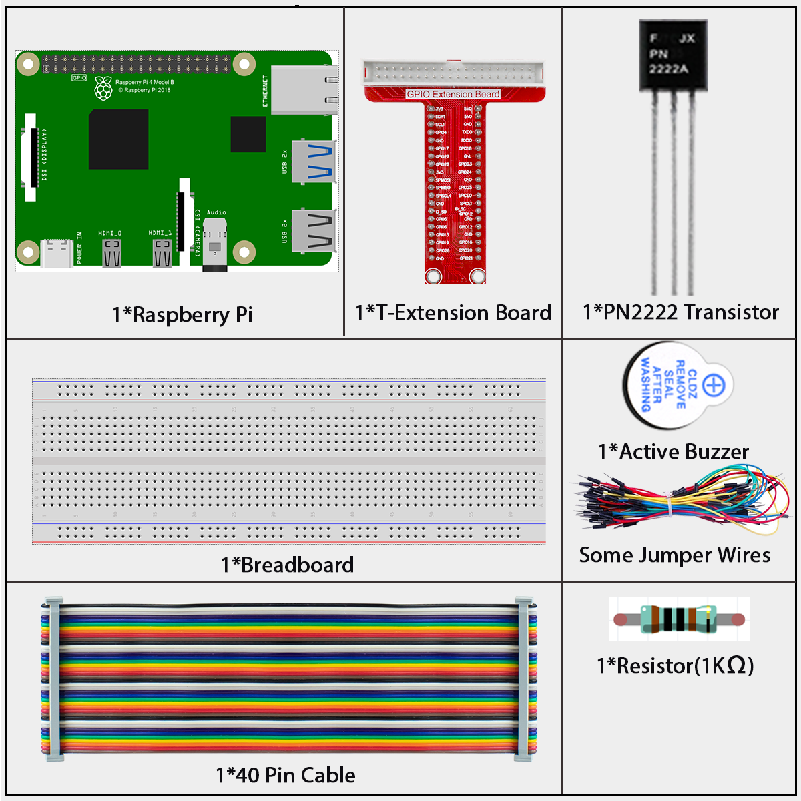

# 1.2.1 Active Buzzer

## Introduction

In this lesson, we will learn how to drive an active buzzer to beep with a PNP transistor.

## **Components**



**Buzzer**

As a type of electronic buzzer with an integrated structure, buzzers, which are supplied by DC power, are widely used in computers, printers, photocopiers, alarms, electronic toys, automotive electronic devices, telephones, timers and other electronic products or voice devices. Buzzers can be categorized as active and passive ones (see the following picture). Turn the buzzer so that its pins are facing up, and the buzzer with a green circuit board is a passive buzzer, while the one enclosed with a black tape is an active one.

The difference between an active buzzer and a passive buzzer:


The difference between an active buzzer and a passive buzzer is: An active buzzer has a built-in oscillating source, so it will make sounds when electrified. But a passive buzzer does not have such source, so it will not beep if DC signals are used; instead, you need to use square waves whose frequency is between 2K and 5K to drive it. The active buzzer is often more expensive than the passive one because of multiple built-in oscillating circuits.

The following is the electrical symbol of a buzzer. It has two pins with positive and negative poles. With a + in the surface represents the anode and the other is the cathode.


You can check the pins of the buzzer, the longer one is the anode and the shorter one is the cathode. Please don’t mix them up when connecting, otherwise the buzzer will not make sound.

In this experiment, an active buzzer, a NPN transistor and a 1k resistor are used between the base of the transistor and GPIO to protect the transistor. When the GPIO17 of Raspberry Pi output is supplied with low level (0V) by programming, the transistor will conduct because of current saturation and the buzzer will make sounds. But when high level is supplied to the IO of Raspberry Pi, the transistor will be cut off and the buzzer will not make sounds.

# 


## Connect

Build the circuit. (Pay attention to poles of the buzzer: The one with + label is the positive pole and the other is the negative.)


## Code

### For  C  Language User

Go to the code folder compile and run.

```sh
cd ~/super-starter-kit-for-raspberry-pi/c/1.2.1/
gcc 1.2.1_ActiveBuzzer.c -lwiringPi
sudo ./a.out
```

The code run, the buzzer beeps.

This is the complete code

```c
#include <wiringPi.h>
#include <stdio.h>

#define BeepPin 0
int main(void){
    if(wiringPiSetup() == -1){ //when initialize wiring failed, print messageto screen
        printf("setup wiringPi failed !");
        return 1;
    }

    pinMode(BeepPin, OUTPUT);   //set GPIO0 output
    while(1){
        //beep on
        printf("Buzzer on\n");
        digitalWrite(BeepPin, LOW);
        delay(100);
        printf("Buzzer off\n");
        //beep off
        digitalWrite(BeepPin, HIGH);
        delay(100);
    }
    return 0;
}
```

### For  Python  Language User

Go to the code folder and run.

```c
cd ~/super-starter-kit-for-raspberry-pi/python
python 1.2.1_ActiveBuzzer.py
```

This is the complete code

```python
import RPi.GPIO as GPIO
import time

# Set #17 as buzzer pin
BeepPin = 17

def setup():
	# Set the GPIO modes to BCM Numbering
	GPIO.setmode(GPIO.BCM)
	# Set LedPin's mode to output, 
	# and initial level to High(3.3v)
	GPIO.setup(BeepPin, GPIO.OUT, initial=GPIO.HIGH)

def main():
	while True:
		# Buzzer on (Beep)
		print ('Buzzer On')
		GPIO.output(BeepPin, GPIO.LOW)
		time.sleep(0.1)
		# Buzzer off
		print ('Buzzer Off')
		GPIO.output(BeepPin, GPIO.HIGH)
		time.sleep(0.1)

def destroy():
	# Turn off buzzer
	GPIO.output(BeepPin, GPIO.HIGH)
	# Release resource
	GPIO.cleanup()    

# If run this script directly, do:
if __name__ == '__main__':
	setup()
	try:
		main()
	# When 'Ctrl+C' is pressed, the program 
	# destroy() will be  executed.
	except KeyboardInterrupt:
		destroy()
```

The code run, the buzzer beeps.

## Phenomenon 


