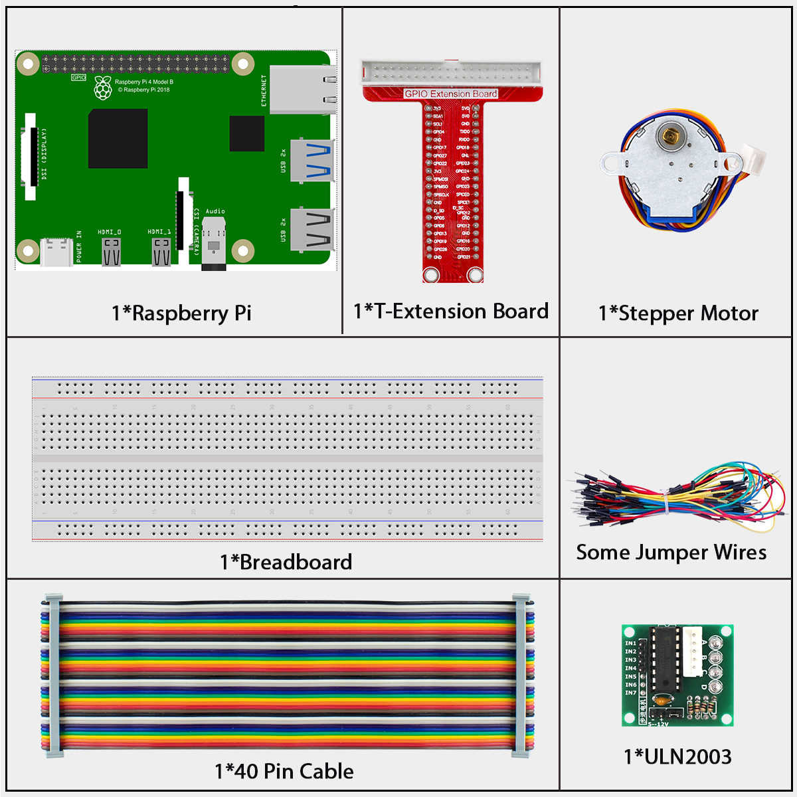
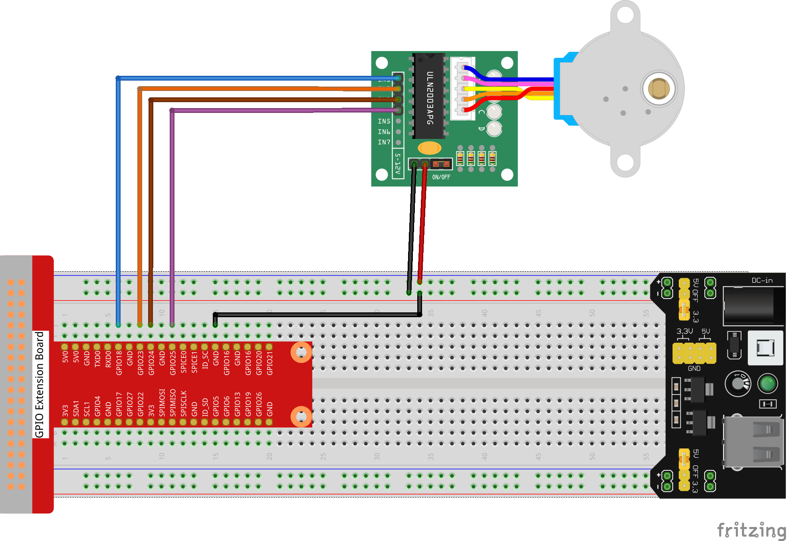

# 1.3.3 Stepper Motor

## Introduction

Stepper motors, due to their unique design, can be controlled to a high degree of accuracy without any feedback mechanisms. The shaft of a stepper, mounted with a series of magnets, is controlled by a series of electromagnetic coils that are charged positively and negatively in a specific sequence, precisely moving it forward or backward in small "steps".

## Components



**Stepper Motor**

There are two types of steppers, unipolars and bipolars, and it is very important to know which type you are working with. In this experiment, we will use a unipolar stepper.

The stepper motor is a four-phase one, which uses a unipolarity DC power supply. As long as you electrify all phase windings of the motor by an appropriate timing sequence, you can make it rotate step by step. The schematic diagram of a four-phase reactive stepper motor:


In the figure, in the middle of the motor is a rotor - a gear-shaped permanent magnet. Around the rotor, 0 to 5 are teeth. Then more outside, there are 8 magnetic poles, with each two opposite ones connected by coil winding. So they form four pairs from A to D, which is called a phase. It has four lead wires to be connected with switches SA, SB, SC, and SD. Therefore, the four phases are in parallel in the circuit, and the two magnetic poles in one phase are in series.

**Here’s how a 4-phase stepper motor works:**

When switch SB is power on, switch SA, SC, and SD is power off, and B-phase magnetic poles align with tooth 0 and 3 of the rotor. At the same time, tooth 1 and 4 generate staggered teeth with C- and D-phase poles. Tooth 2 and 5 generate staggered teeth with D- and A-phase poles. When switch SC is power on, switch SB, SA, and SD is power off, the rotor rotates under magnetic field of C-phase winding and that between tooth 1 and 4. Then tooth 1 and 4 align with the magnetic poles of C-phase winding. While tooth 0 and 3 generate staggered teeth with A- and B-phase poles, and tooth 2 and 5 generate staggered teeth with the magnetic poles of A- and D-phase poles. The similar situation goes on and on. Energize the A, B, C and D phases in turn, and the rotor will rotate in the order of A, B, C and D.


The four-phase stepper motor has three operating modes: single four-step, double four-step, and eight-step. The step angle for the single four-step and double four-step are the same, but the driving torque for the single four-step is smaller. The step angle of the eight-step is half that of the single four-step and double four-step. Thus, the eight-step operating mode can keep high driving torque and improve control accuracy.

The stator of Stepper Motor we use has 32 magnetic poles, so a circle needs 32 steps. The output shaft of the Stepper Motor is connected with a reduction gear set, and the reduction ratio is 1/64. So the final output shaft rotates a circle requiring a 32*64=2048 step.

**ULN2003**

To apply the motor in the circuit, a driver board needs to be used. Stepper Motor Driver-ULN2003 is a 7-channel inverter circuit. That is, when the input pin is at high level, the output pin of ULN2003 is at low level, and vice versa. If we supply high level to IN1, and low level to IN2, IN3 and IN4, then the output end OUT1 is at low level, and all the other output ends are at high level.  The internal structure of the chip is shown as below.


The stepper motor driver constituted by ULN2003 chip and 4 LEDs is shown as follows. On the board, IN1,IN2,IN3 and IN4 work as input and the four LEDs, A, B, C, D are the indicators of input pin. In addition, OUT1,OUT2, OUT3 and OUT4 are connected to SA, SB, SC and SD on the stepper motor driver. When the value of IN1 is set to a high level, A lights up; switch SA is power on, and the stepper motor rotates one step. The similar case repeats on and on. Therefore, just give the stepper motor a specific timing sequence, it will rotate step by step. The ULN2003 here is used to provide particular timing sequences for the stepper motor.


## connect




## Code

### For C Language User

Go to the code folder compile and run.

```sh
cd ~/super-starter-kit-for-raspberry-pi/c/1.3.2/
gcc 1.3.3_StepperMotor.c -lwiringPi
sudo ./a.out
```

As the code runs, the stepper motor will rotate clockwise or anticlockwise according to your input 'a' or 'c'.

This is the complete code

```c
#include <stdio.h>
#include <wiringPi.h>

const int motorPin[] = {1, 4, 5, 6};
int rolePerMinute = 15;
int stepsPerRevolution = 2048;
int stepSpeed = 0;

void rotary(char direction){
    if(direction == 'c'){
        for(int j=0;j<4;j++){
            for(int i=0;i<4;i++)
                {digitalWrite(motorPin[i],0x99>>j & (0x08>>i));}
            delayMicroseconds(stepSpeed);
        }
    }
    else if(direction =='a'){
        for(int j=0;j<4;j++){
            for(int i=0;i<4;i++)
                {digitalWrite(motorPin[i],0x99<<j & (0x80>>i));}
            delayMicroseconds(stepSpeed);
        }
    }
}

void loop()
{
    char direction = '0';
    while (1)
    {
        printf("select motor direction a=anticlockwise, c=clockwise: ");
        delay(100);
        direction=getchar();
        if (direction == 'c')
        {
            printf("motor running clockwise\n");
            delay(100);
            break;
        }
        else if (direction == 'a')
        {
            printf("motor running anti-clockwise\n");
            delay(100);
            break;
        }
        else
        {
            printf("input error, please try again!\n");
            delay(100);
        }
    }
    while(1)
    {
        rotary(direction);
    }
}

void main(void)
{
    if (wiringPiSetup() == -1)
    {
        printf("setup wiringPi failed !");
        return;
    }
    for (int i = 0; i < 4; i++)
    {
        pinMode(motorPin[i], OUTPUT);
    }
    stepSpeed = (60000000 / rolePerMinute) / stepsPerRevolution;
    loop();
}
```

### For  Python  Language User

Go to the code folder and run.

```sh
cd ~/super-starter-kit-for-raspberry-pi/python
python 1.3.3_StepperMotor.py
```

As the code runs, the stepper motor will rotate clockwise or anticlockwise according to your input 'a' or 'c'.

This is the complete code

```python
import RPi.GPIO as GPIO
from time import sleep

motorPin = (18,23,24,25) 
rolePerMinute =15
stepsPerRevolution = 2048
stepSpeed = (60/rolePerMinute)/stepsPerRevolution

def setup():
    GPIO.setwarnings(False)
    GPIO.setmode(GPIO.BCM)
    for i in motorPin:
        GPIO.setup(i, GPIO.OUT)

def rotary(direction):
    if(direction == 'c'):   
        for j in range(4):
            for i in range(4):
                GPIO.output(motorPin[i],0x99>>j & (0x08>>i))
            sleep(stepSpeed)

    elif(direction == 'a'):
        for j in range(4):
            for i in range(4):
                GPIO.output(motorPin[i],0x99<<j & (0x80>>i))
            sleep(stepSpeed)

def loop():
    while True:
        direction = input('select motor direction a=anticlockwise, c=clockwise: ')
        if(direction == 'c'):
            print('motor running clockwise\n')
            break
        elif(direction == 'a'):
            print('motor running anti-clockwise\n')
            break
        else:
            print('input error, please try again!')
    while True:
        rotary(direction)

def destroy():
    GPIO.cleanup()   

if __name__ == '__main__':    
    setup()
    try:
        loop()        
    except KeyboardInterrupt:
        destroy()
```

## Phenomenon


