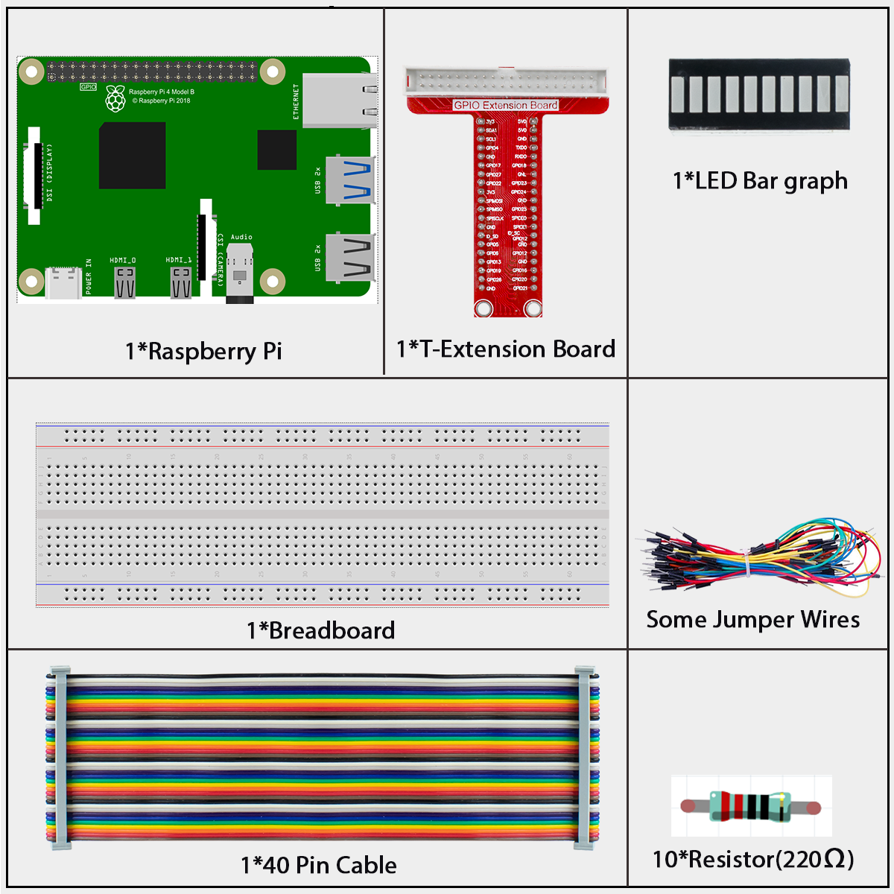
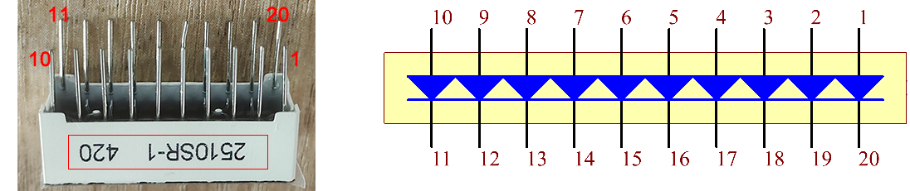
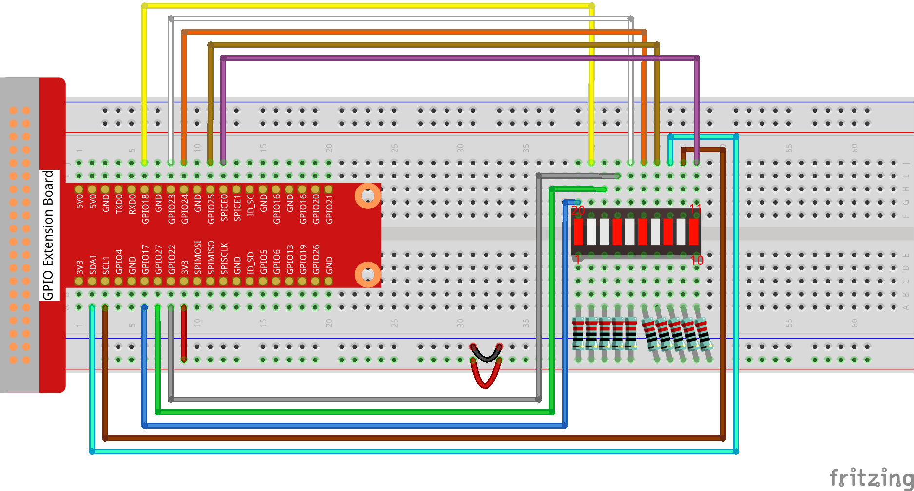

# 1.3.5 LED Bar Graph

## Introduction

In this lesson, we sequentially illuminate the lights on the LED Bar Graph.

## Components



**LED Bar Graph**

LED Bar Graph is an LED array, which is used to connect with electronic circuit or microcontroller. It’s easy to connect LED bar graph with the circuit like as connecting 10 individual LEDs with 10 output pins. Generally we can use the LED bar graph as a Battery level Indicator, Audio equipments, and Industrial Control panels. There are many other applications of LED bar graphs.



| T-Board Name | physical | wiringPi | BCM  |
| ------------ | -------- | -------- | ---- |
| GPIO17       | Pin 11   | 0        | 17   |
| GPIO18       | Pin 12   | 1        | 18   |
| GPIO27       | Pin 13   | 2        | 27   |
| GPIO22       | Pin 15   | 3        | 22   |
| GPIO23       | Pin 16   | 4        | 23   |
| GPIO24       | Pin 18   | 5        | 24   |
| GPIO25       | Pin 22   | 6        | 25   |
| SDA1         | Pin 3    | 8        | 2    |
| SCL1         | Pin 5    | 9        | 3    |
| SPICE0       | Pin 24   | 10       | 8    |


## Connect




## Code

### For C Language User

Go to the folder of the code.

```shell
cd ~/super-starter-kit-for-raspberry-pi/c/1.3.5/
```

Compile the code. 

```shell
gcc 1.3.5_LedBarGraph.c -lwiringPi
```

> <div class="warning" style="background-color: #E7F2FA; color=#6AB0DE; padding: 10px; border: 1px solid #333; border-radius: 5px;">
>     NOTE: When the instruction "gcc" is executed, if "-o" is not called, then the executable file is named "a.out".
> </div>

Run the executable file.

```shell
sudo ./a.out
```

After the code runs, you will see the LEDs on the LED bar turn on and off regularly.

This is the complete code

```c
#include <wiringPi.h>
#include <stdio.h>

int pins[10] = {0,1,2,3,4,5,6,8,9,10};
void oddLedBarGraph(void){
    for(int i=0;i<5;i++){
        int j=i*2;
        digitalWrite(pins[j],HIGH);
        delay(300);
        digitalWrite(pins[j],LOW);
    }
}
void evenLedBarGraph(void){
    for(int i=0;i<5;i++){
        int j=i*2+1;
        digitalWrite(pins[j],HIGH);
        delay(300);
        digitalWrite(pins[j],LOW);
    }
}
void allLedBarGraph(void){
    for(int i=0;i<10;i++){
        digitalWrite(pins[i],HIGH);
        delay(300);
        digitalWrite(pins[i],LOW);
    }
}
int main(void)
{
    if(wiringPiSetup() == -1){ //when initialize wiring failed,print message to screen
        printf("setup wiringPi failed !");
        return 1;
    }
    for(int i=0;i<10;i++){       //make led pins' mode is output
        pinMode(pins[i], OUTPUT);
        digitalWrite(pins[i],LOW);
    }
    while(1){
        oddLedBarGraph();
        delay(300);
        evenLedBarGraph();
        delay(300);
        allLedBarGraph();
        delay(300);
    }
    return 0;
}#include <wiringPi.h>
#include <softPwm.h>
#include <stdio.h>
#define uchar unsigned char
#define LedPinRed    0
#define LedPinGreen  1
#define LedPinBlue   2

void ledInit(void){
    softPwmCreate(LedPinRed,  0, 100);
    softPwmCreate(LedPinGreen,0, 100);
    softPwmCreate(LedPinBlue, 0, 100);
}

void ledColorSet(uchar r_val, uchar g_val, uchar b_val){
    softPwmWrite(LedPinRed,   r_val);
    softPwmWrite(LedPinGreen, g_val);
    softPwmWrite(LedPinBlue,  b_val);
}

int main(void){

    if(wiringPiSetup() == -1){ //when initialize wiring failed, printf messageto screen
        printf("setup wiringPi failed !");
        return 1;
    }

    ledInit();
    while(1){
        printf("Red\n");
        ledColorSet(0xff,0x00,0x00);   //red
        delay(500);
        printf("Green\n");
        ledColorSet(0x00,0xff,0x00);   //green
        delay(500);
        printf("Blue\n");
        ledColorSet(0x00,0x00,0xff);   //blue
        delay(500);
        printf("Yellow\n");
        ledColorSet(0xff,0xff,0x00);   //yellow
        delay(500);
        printf("Purple\n");
        ledColorSet(0xff,0x00,0xff);   //purple
        delay(500);
        printf("Cyan\n");
        ledColorSet(0xc0,0xff,0x3e);   //cyan
        delay(500);
    }
    return 0;
}
```

### For Python Language User

Go to the code folder and run.

```shell
cd ~/super-starter-kit-for-raspberry-pi/python
```

```shell
python 1.3.5_LedBarGraph.py
```

After the code runs, you will see the LEDs on the LED bar turn on and off regularly.

This is the complete code

```python
import RPi.GPIO as GPIO
import time

ledPins = [11, 12, 13, 15, 16, 18, 22, 3, 5, 24]

def oddLedBarGraph():
    for i in range(5):
        j = i*2
        GPIO.output(ledPins[j],GPIO.HIGH)
        time.sleep(0.3)
        GPIO.output(ledPins[j],GPIO.LOW)

def evenLedBarGraph():
    for i in range(5):
        j = i*2+1
        GPIO.output(ledPins[j],GPIO.HIGH)
        time.sleep(0.3)
        GPIO.output(ledPins[j],GPIO.LOW)

def allLedBarGraph():
    for i in ledPins:
        GPIO.output(i,GPIO.HIGH)
        time.sleep(0.3)
        GPIO.output(i,GPIO.LOW)

def setup():
    GPIO.setwarnings(False)
    GPIO.setmode(GPIO.BOARD)        # Numbers GPIOs by physical location
    for i in ledPins:
        GPIO.setup(i, GPIO.OUT)   # Set all ledPins' mode is output
        GPIO.output(i, GPIO.LOW) # Set all ledPins to high(+3.3V) to off led

def loop():
    while True:
        oddLedBarGraph()
        time.sleep(0.3)
        evenLedBarGraph()
        time.sleep(0.3)
        allLedBarGraph()
        time.sleep(0.3)

def destroy():
    for pin in ledPins:
        GPIO.output(pin, GPIO.LOW)    # turn off all leds
    GPIO.cleanup()                     # Release resource

if __name__ == '__main__':     # Program start from here
    setup()
    try:
        loop()
    except KeyboardInterrupt:  # When 'Ctrl+C' is pressed, the program destroy() will be  executed.
        destroy()
```


## Phenomenon


