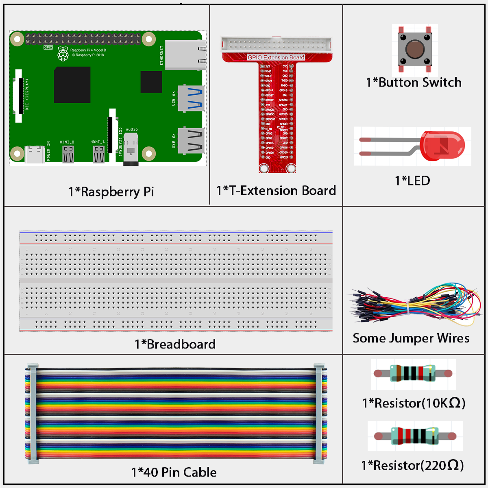

# 2.1.1 Button

## Introduction

In this lesson, we will learn how to turn on or off the LED by using a button.

## Components



**Button**

Button is a common component used to control electronic devices. It is usually used as switch to connect or break circuits. Although buttons come in a variety of sizes and shapes, the one used here is a 6mm mini-button as shown in the following pictures.

Two pins on the left are connected, and the one on the right is similar to the left, which is shown below:


The symbol shown as below is usually used to represent a button in circuits.


When the button is pressed, the 4 pins are connected, thus closing the circuit.

## Connect

Use a normally open button as the input of Raspberry Pi, the connection is shown in the schematic diagram below. When the button is pressed, the GPIO18 will turn into low level (0V). We can detect the state of the GPIO18 through programming. That is, if the GPIO18 turns into low level, it means the button is pressed. You can run the corresponding code when the button is pressed, and then the LED will light up.

<div class="warning" style="background-color: #E7F2FA; color=#6AB0DE; padding: 10px; border: 1px solid #333; border-radius: 5px;">
    NOTE: The longer pin of the LED is the anode and the shorter one is the cathode.
</div>


## Code

### For  C  Language User

Go to the code folder compile and run.

```sh
cd ~/super-starter-kit-for-raspberry-pi/c/2.1.1/
gcc 2.1.1_Button.c -lwiringPi
sudo ./a.out
```

After the code runs, press the button, the LED lights up; otherwise, turns off.

This is the complete code

```c
#include <wiringPi.h>
#include <stdio.h>

#define LedPin      0
#define ButtonPin   1

int main(void){
    // When initialize wiring failed, print message to screen
    if(wiringPiSetup() == -1){
        printf("setup wiringPi failed !");
        return 1;
    }

    pinMode(LedPin, OUTPUT);
    pinMode(ButtonPin, INPUT);
    digitalWrite(LedPin, HIGH);

    while(1){
        // Indicate that button has pressed down
        if(digitalRead(ButtonPin) == 0){
            // Led on
            digitalWrite(LedPin, LOW);
        //  printf("...LED on\n");
        }
        else{
            // Led off
            digitalWrite(LedPin, HIGH);
        //  printf("LED off...\n");
        }
    }
    return 0;
}
```

### For  Python  Language User

Go to the code folder and run.

```sh
cd ~/super-starter-kit-for-raspberry-pi/python
python 2.1.1_Button.py
```

After the code runs, press the button, the LED lights up; otherwise, turns off.

This is the complete code

```python
import RPi.GPIO as GPIO
import time

LedPin = 17 # Set GPIO17 as LED pin
BtnPin = 18 # Set GPIO18 as button pin


Led_status = True # Set Led status to True(OFF)

# Define a setup function for some setup
def setup():
	# Set the GPIO modes to BCM Numbering
	GPIO.setmode(GPIO.BCM)
	GPIO.setup(LedPin, GPIO.OUT, initial=GPIO.HIGH)  # Set LedPin's mode to output, and initial level to high (3.3v)
	GPIO.setup(BtnPin, GPIO.IN) # Set BtnPin's mode to input.

# Define a callback function for button callback
def swLed(ev=None):
	global Led_status
	# Switch led status(on-->off; off-->on)
	Led_status = not Led_status
	GPIO.output(LedPin, Led_status)
	if Led_status:
		print ('LED OFF...')
	else:
		print ('...LED ON')

# Define a main function for main process
def main():
	# Set up a falling detect on BtnPin, 
	# and callback function to swLed
	GPIO.add_event_detect(BtnPin, GPIO.FALLING, callback=swLed)
	while True:
		# Don't do anything.
		time.sleep(1)

# Define a destroy function for clean up everything after
# the script finished 
def destroy():
	# Turn off LED
	GPIO.output(LedPin, GPIO.HIGH)
	# Release resource
	GPIO.cleanup()

# If run this script directly, do:
if __name__ == '__main__':
	setup()
	try:
		main()
	# When 'Ctrl+C' is pressed, the program 
	# destroy() will be  executed.
	except KeyboardInterrupt:
		destroy()

```

## Phenomenon

