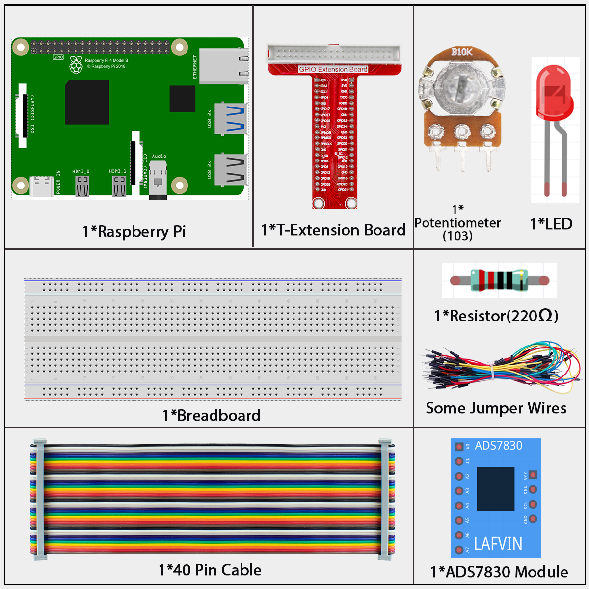
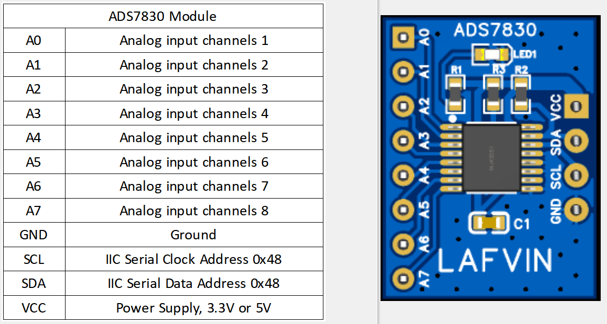
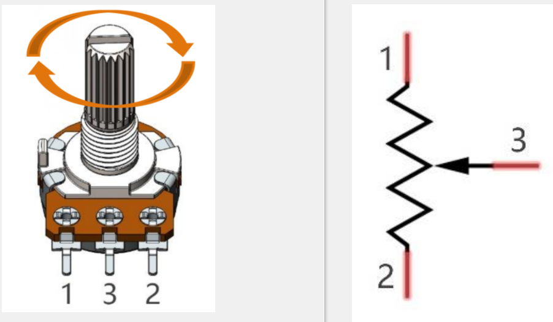

# 2.1.4 Potentiometer

## Introduction

The ADC function can be used to convert analog signals to digital signals, and in this experiment, ADC0834 is used to get the function involving ADC. Here, we implement this process by using potentiometer. Potentiometer changes the physical quantity – voltage, which is converted by the ADC function.

## Components



**ADS7830**

The ADS7830 is a single-supply, low-power, 8-bit data acquisition device that features a serial I2C interface and an 8-channel multiplexer. The following table is the pin definition diagram of ADS7830.



**ADC**

An ADC is an electronic integrated circuit used to convert analog signals such as voltages to digital or
binary form consisting of 1s and 0s. The range of our ADC module is 8 bits, that means the resolution is
2^8=256, so that its range (at 3.3V) will be divided equally to 256 parts.
Any analog value can be mapped to one digital value using the resolution of the converter. So the more bits
the ADC has, the denser the partition of analog will be and the greater the precision of the resulting conversion.


Subsection 1: the analog in range of 0V-3.3/256 V corresponds to digital 0;

Subsection 2: the analog in range of 3.3 /256 V-2*3.3 /256V corresponds to digital 1;

…

The resultant analog signal will be divided accordingly.

**Potentiometer**

Potentiometer is also a resistance component with 3 terminals and its resistance value can be adjusted according to some regular variation. Potentiometer usually consists of resistor and movable brush. When the brush is moving along the resistor, there is a certain resistance or voltage output depending on the displacement.The total resistance of the potentiometer is 10K.



The functions of the potentiometer in the circuit are as follows:

Serving as a voltage divider

Potentiometer is a continuously adjustable resistor. When you adjust the shaft or sliding handle of the potentiometer, the movable contact will slide on the resistor. At this point, a voltage can be output depending on the voltage applied onto the potentiometer and the angle the movable arm has rotated to or the distance it moves.

## Connect


<div class="warning" style="background-color: #E7F2FA; color=#6AB0DE; padding: 10px; border: 1px solid #333; border-radius: 5px;">
    NOTE: Please place the chip by referring to the corresponding position depicted in the picture. Note that the grooves on the chip should be on the left when it is placed.
</div>

## Code

### For  C  Language User

Go to the code folder compile and run.

```sh
cd ~/super-starter-kit-for-raspberry-pi/c/2.1.4/
g++ 2.1.4_Potentiometer.cpp -lwiringPi -lADCDevice
sudo ./a.out
```

After the code runs, rotate the knob on the potentiometer, the intensity of LED will change accordingly.

This is the complete code

```c
#include <wiringPi.h>
#include <stdio.h>
#include <softPwm.h>
#include <ADCDevice.hpp>

#define ledPin 0

ADCDevice *adc;  // Define an ADC Device class object

int main(void){
    adc = new ADCDevice();
    printf("Program is starting ... \n");
    
    if(adc->detectI2C(0x48)){// Detect the ads7830
        delete adc;               // Free previously pointed memory
        adc = new ADS7830();      // If detected, create an instance of ADS7830.
    }
    else{
        printf("No correct I2C address found, \n"
        "Please use command 'i2cdetect -y 1' to check the I2C address! \n"
        "Program Exit. \n");
        return -1;
    }
    wiringPiSetup();
    softPwmCreate(ledPin,0,100);
    while(1){
        int adcValue = adc->analogRead(0);    //read analog value of A0 pin
        softPwmWrite(ledPin,adcValue*100/255);    // Mapping to PWM duty cycle
        float voltage = (float)adcValue / 255.0 * 3.3;  // Calculate voltage
        printf("ADC value : %d  ,\tVoltage : %.2fV\n",adcValue,voltage);
        delay(30);
    }
    return 0;
}

```

### For  Python  Language User

Go to the code folder and run.

```sh
cd ~/super-starter-kit-for-raspberry-pi/python
python 2.1.4_Potentiometer.py
```

After the code runs, rotate the knob on the potentiometer, the intensity of LED will change accordingly.

This is the complete code

```python
import RPi.GPIO as GPIO
import time
from ADCDevice import *

ledPin = 11
adc = ADCDevice() # Define an ADCDevice class object

def setup():
    global adc
    if(adc.detectI2C(0x48)): # Detect the ads7830
        adc = ADS7830()
    else:
        print("No correct I2C address found, \n"
        "Please use command 'i2cdetect -y 1' to check the I2C address! \n"
        "Program Exit. \n");
        exit(-1)
    global p
    GPIO.setmode(GPIO.BOARD)
    GPIO.setup(ledPin,GPIO.OUT)
    p = GPIO.PWM(ledPin,1000)
    p.start(0)
        
def loop():
    while True:
        value = adc.analogRead(0)    # read the ADC value of channel 0
        p.ChangeDutyCycle(value*100/255)        # Mapping to PWM duty cycle
        voltage = value / 255.0 * 3.3  # calculate the voltage value
        print ('ADC Value : %d, Voltage : %.2f'%(value,voltage))
        time.sleep(0.03)

def destroy():
    p.stop()  # stop PWM
    GPIO.cleanup()
    adc.close()
    
if __name__ == '__main__':   # Program entrance
    print ('Program is starting ... ')
    try:
        setup()
        loop()
    except KeyboardInterrupt: # Press ctrl-c to end the program.
        destroy()
```

## Phenomenon


