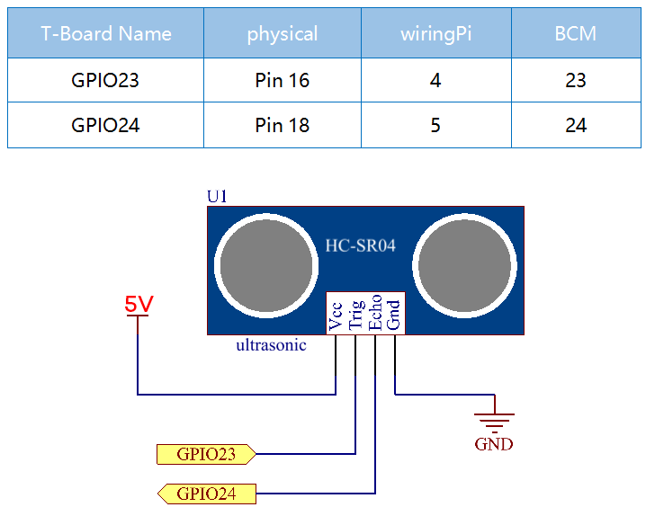
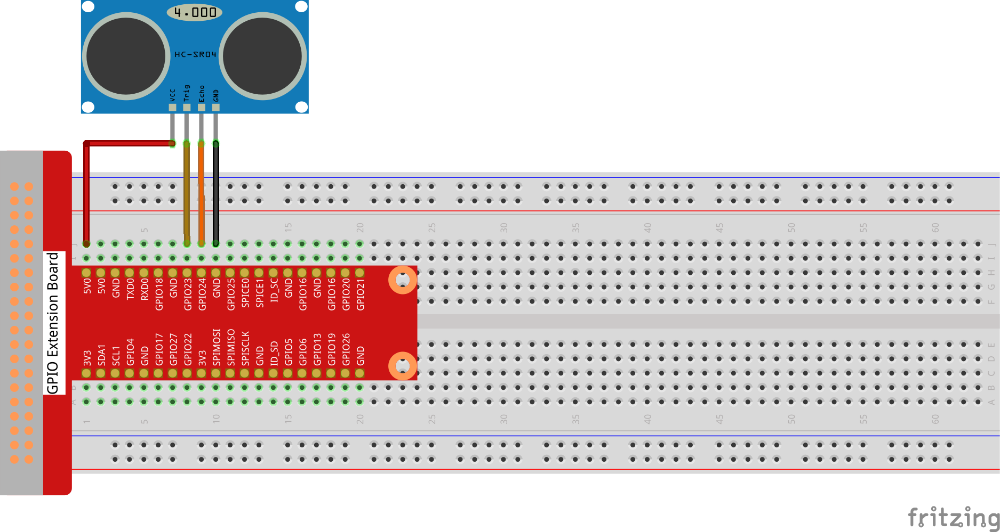

# 2.2.5 Ultrasonic Sensor Module

## Introduction

The ultrasonic sensor uses ultrasonic to accurately detect objects and measure distances. It sends out ultrasonic waves and converts them into electronic signals.

## Components


**Ultrasonic**

Ultrasonic ranging module provides 2cm - 400cm non-contact measurement function, and the ranging accuracy can reach to 3mm. It can ensure that the signal is stable within 5m, and the signal is gradually weakened after 5m, till the 7m position disappears.

The module includes ultrasonic transmitters, receiver and control circuit. The basic principles are as follows:

(1)Use an IO flip-flop to process a high level signal of at least 10us.

(2)The module automatically sends eight 40khz and detects if there is a pulse signal return.

(3)If the signal returns, passing the high level, the high output IO duration is the time from the transmission of the ultrasonic wave to the return of it. Here, test distance = (high time x sound speed (340 m / s) / 2.


The timing diagram is shown below. You only need to supply a short 10us pulse for the trigger input to start the ranging, and then the module will send out an 8 cycle burst of ultrasound at 40 kHz and raise its echo. You can calculate the range through the time interval between sending trigger signal and receiving echo signal.

Formula: us / 58 = centimeters or us / 148 =inch; or: the range = high level time * velocity (340M/S) / 2; you are suggested to use measurement cycle over 60ms in order to prevent signal collisions of trigger signal and the echo signal.


## Connect





## Code

### For  C  Language User

Go to the code folder compile and run.

```sh
cd ~/davinci-kit-for-raspberry-pi/c/2.2.5/
gcc 2.2.5_Ultrasonic.c -lwiringPi
sudo ./a.out
```

With the code run, the ultrasonic sensor module detects the distance between the obstacle ahead and the module itself, then the distance value will be printed on the screen.

This is the complete code

```c
#include <wiringPi.h>
#include <stdio.h>
#include <sys/time.h>

#define Trig    4
#define Echo    5

void ultraInit(void)
{
    pinMode(Echo, INPUT);
    pinMode(Trig, OUTPUT);
}

float disMeasure(void)
{
    struct timeval tv1;
    struct timeval tv2;
    long time1, time2;
float dis;

    digitalWrite(Trig, LOW);
    delayMicroseconds(2);

    digitalWrite(Trig, HIGH);
    delayMicroseconds(10);
    digitalWrite(Trig, LOW);

    while(!(digitalRead(Echo) == 1));
    gettimeofday(&tv1, NULL);

    while(!(digitalRead(Echo) == 0));
    gettimeofday(&tv2, NULL);

    time1 = tv1.tv_sec * 1000000 + tv1.tv_usec;
    time2  = tv2.tv_sec * 1000000 + tv2.tv_usec;

    dis = (float)(time2 - time1) / 1000000 * 34000 / 2;

    return dis;
}

int main(void)
{
    float dis;
    if(wiringPiSetup() == -1){ //when initialize wiring failed,print message to screen
        printf("setup wiringPi failed !");
        return 1;
    }

    ultraInit();

    while(1){
        dis = disMeasure();
        printf("%0.2f cm\n\n",dis);
        delay(300);
    }

    return 0;
}
```

### For  Python  Language User

Go to the code folder and run.

```sh
cd ~/super-starter-kit-for-raspberry-pi/python
python 2.2.5_Ultrasonic.py
```

```python
import RPi.GPIO as GPIO
import time

TRIG = 16
ECHO = 18

def setup():
	GPIO.setmode(GPIO.BOARD)
	GPIO.setup(TRIG, GPIO.OUT)
	GPIO.setup(ECHO, GPIO.IN)

def distance():
	GPIO.output(TRIG, 0)
	time.sleep(0.000002)

	GPIO.output(TRIG, 1)
	time.sleep(0.00001)
	GPIO.output(TRIG, 0)

	
	while GPIO.input(ECHO) == 0:
		a = 0
	time1 = time.time()
	while GPIO.input(ECHO) == 1:
		a = 1
	time2 = time.time()

	during = time2 - time1
	return during * 340 / 2 * 100

def loop():
	while True:
		dis = distance()
		print ('Distance: %.2f' % dis)
		time.sleep(0.3)

def destroy():
	GPIO.cleanup()

if __name__ == "__main__":
	setup()
	try:
		loop()
	except KeyboardInterrupt:
		destroy()
```


## Phenomenon


