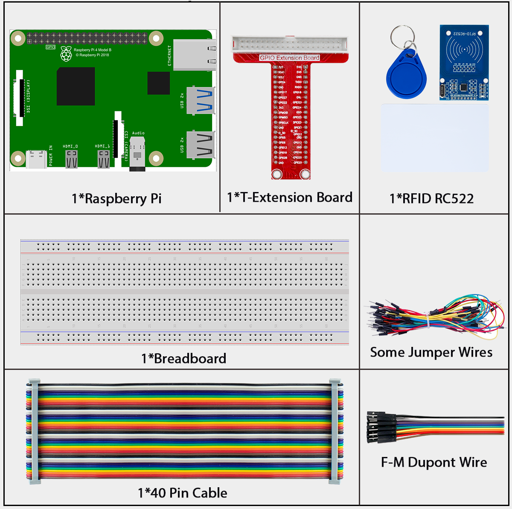

# 2.2.7 MFRC522 RFID Module

## Introduction

Radio Frequency Identification (RFID) refers to technologies that use wireless communication between an object (or tag) and interrogating device (or reader) to automatically track and identify such objects.

Some of the most common applications for this technology include retail supply chains, military supply chains, automated payment methods, baggage tracking and management, document tracking and pharmaceutical management, to name a few.

In this project, we will use RFID for reading and writing.

## Components



**RFID**

Radio Frequency Identification RFID refers to technologies that involve using wireless communication between an object (or tag) and an interrogating device (or reader) to automatically track and identify such objects. The tag transmission range is limited to several meters from the reader. A clear line of sight between the reader and tag is not necessarily required.

Most tags contain at least one integrated circuit (IC) and an antenna. The microchip stores information and is responsible for managing the radio frequency (RF) communication with the reader. Passive tags do not have an independent energy source and depend on an external electromagnetic signal, provided by the reader, to power their operations. Active tags contain an independent energy source, such as a battery. Thus, they may have increased processing, transmission capabilities and range.

## Connect


## Code

### For  C  Language User

Go to the code folder compile and run.

```sh
cd ~/super-starter-kit-for-raspberry-pi/c/2.2.7/
make read
make write
sudo read
sudo wriet
```

With the code run， You can write and read the data in the card

### For  Python  Language User

1.Switch directory

2.Activation virtual environment

3.Installation library

4.Exit the virtual environment

5.Run executable file

```sh
1.
cd ~/super-starter-kit-for-raspberry-pi/python/2.2.7
2.
source myenv/bin/activate
3.
sudo pip3 install spidev
sudo pip3 install mfrc522
4.
deactivate
5.
sudo python3 2.2.7_read.py
sudo python3 2.2.7_write.py
```
This is the complete code

```python
# read
import time
from mfrc522 import SimpleMFRC522
import RPi.GPIO as GPIO

reader = SimpleMFRC522()

def main():
    while True:
        print("Reading...Please place the card...")
        id, text = reader.read()
        print("ID: %s\nText: %s" % (id,text))
        time.sleep(3)

def destroy():
    GPIO.cleanup()

if __name__ == '__main__':
    try:
        main()
    # When 'Ctrl+C' is pressed, the program destroy() will be  executed.
    except KeyboardInterrupt:
        destroy()
```

```python
# write
from mfrc522 import SimpleMFRC522
import RPi.GPIO as GPIO

reader = SimpleMFRC522()

def main():
    while True:
        text = input('Please write new data:')
        print("Please place the card to complete writing")
        reader.write(text)
        print("Data writing is complete")

def destroy():
    GPIO.cleanup()

if __name__ == '__main__':
    try:
        main()
    # When 'Ctrl+C' is pressed, the program destroy() will be  executed.
    except KeyboardInterrupt:
        destroy()
```
## Phenomenon


