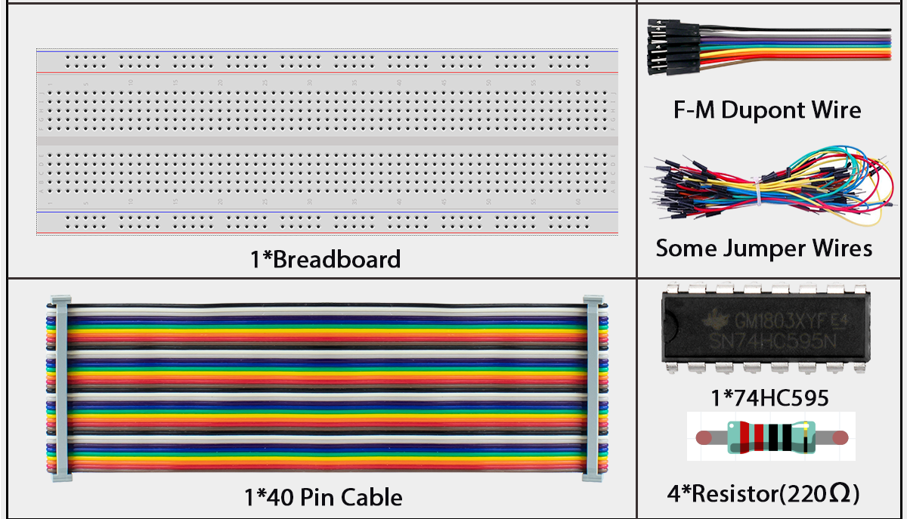
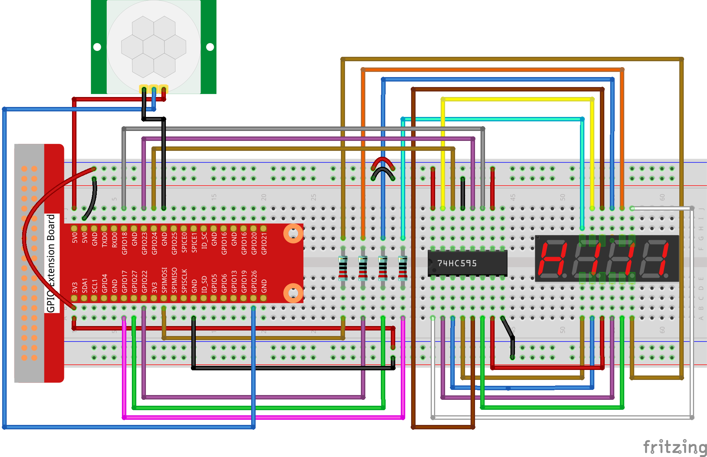
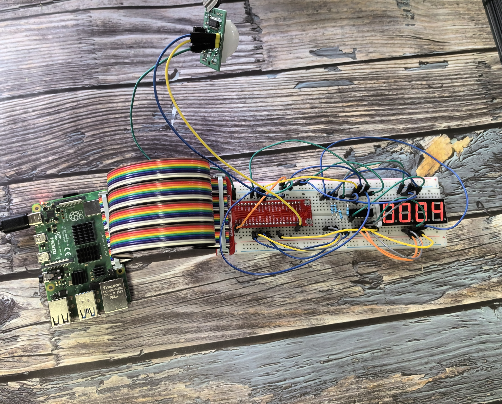

# 3.1.1 Counting Device

## Introduction

Here we will make a number-displaying counter system, consisting of a PIR sensor and a 4-digit segment display. When the PIR detects that someone is passing by, the number on the 4-digit segment display will add 1. You can use this counter to count the number of people walking through the passageway.

## Components



## Connect

| T-Board Name | physical | wiringPi | BCM  |
| ------------ | :------- | -------- | ---- |
| GPIO17       | Pin 11   | 0        | 17   |
| GPIO27       | Pin 13   | 2        | 27   |
| GPIO22       | Pin 15   | 3        | 22   |
| SPIMOSI      | Pin 19   | 12       | 10   |
| GPIO18       | Pin 12   | 1        | 18   |
| GPIO23       | Pin 16   | 4        | 23   |
| GPIO24       | Pin 18   | 5        | 24   |
| GPIO26       | Pin 37   | 25       | 26   |




<div class="warning" style="background-color: #E7F2FA; color=#6AB0DE; padding: 10px; border: 1px solid #333; border-radius: 5px;">
    NOTE: The PIR sensor will have a one-minute initialization time after powering on. During this period, infrared signals should be avoided, otherwise the measurement may be inaccurate.
</div>

## Code

### For  C  Language User

Go to the code folder compile and run.

```sh
cd ~/super-starter-kit-for-raspberry-pi/c/3.1.1/
gcc 3.1.1_CountingDevice.c -lwiringPi
sudo ./a.out
```

<div class="warning" style="background-color: #E7F2FA; color=#6AB0DE; padding: 10px; border: 1px solid #333; border-radius: 5px;">
    NOTE: If you want to check the complete codes, you are suggested to use command `nano 3.1.1_CountingDevice.c`.
</div>

After the code runs, when the PIR detects that someone is passing by, the number on the 4-digit segment display will add 1.

### For  Python  Language User

Go to the code folder and run.

```sh
cd ~/super-starter-kit-for-raspberry-pi/python
python 3.1.1_CountingDevice.py
```

After the code runs, when the PIR detects that someone is passing by, the number on the 4-digit segment display will add 1.

TIP：There are two potentiometers on the PIR module: one is to adjust sensitivity and the other is to adjust the detection distance. To make the PIR module work better, you You need to turn both of them counterclockwise to the end.

## Phenomenon

