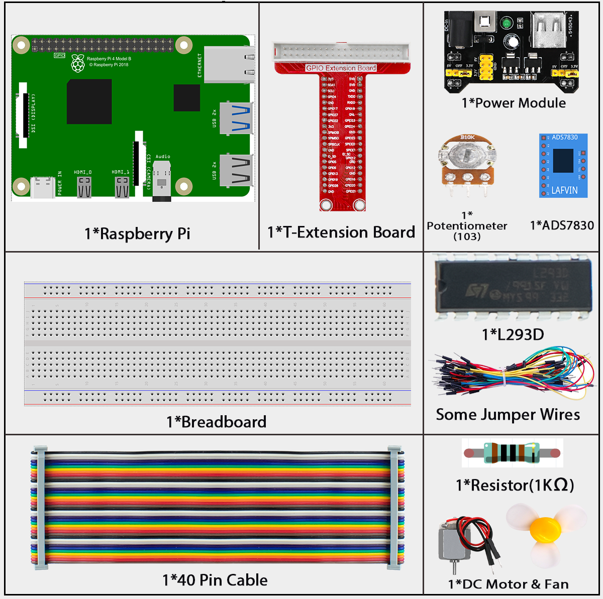

cd ~/super-starter-kit-for-raspberry-pi/Python/

# 3.1.4  Adjustable Fan

## Introduction

For this project, we will be constructing an adjustable fan system by utilizing components such as the ADS7830 analog-to-digital converter, the L293D motor driver chip, a potentiometer for variable resistance, and a motor. By integrating these components together, we will create a fan whose speed can be manually adjusted and controlled through the potentiometer input.

## Components



## Connect

| T-Board Name | physical | wiringPi | BCM  |
| ------------ | -------- | -------- | ---- |
| GPIO17       | Pin 11   | 0        | 17   |
| GPIO18       | Pin 12   | 1        | 18   |
| GPIO27       | Pin 13   | 2        | 27   |
| GPIO22       | Pin 15   | 3        | 22   |
| GPIO5        | Pin 29   | 21       | 5    |
| GPIO6        | Pin 31   | 22       | 6    |
| GPIO13       | Pin 33   | 23       | 13   |


<div class="warning" style="background-color: #E7F2FA; color=#6AB0DE; padding: 10px; border: 1px solid #333; border-radius: 5px;">
    NOTE: The power module can apply a 9V battery with the 9V Battery Buckle in the kit. Insert the jumper cap of the power module into the 5V bus strips of the breadboard.
</div>


### For  C  Language

Go to the code folder compile and run.

```sh
cd ~/super-starter-kit-for-raspberry-pi/c/3.1.4/
```

```sh
g++ 3.1.4_AdjustableFan.cpp -lwiringPi -lADCDevice
```

```sh
sudo ./a.out
```

After the program is executed,you can use the Potentiometer to control the DC Motor.When the Potentiometer is at the midpoint position,the DC Motor will STOP,and when the Potentiometer is turned in either direction of this midpoint,the DC Motor speed increases until it reaches the endpoint where the DC Motor achieves its maximum speed.When the Potentiometer is turned "Left"of the midpoint the DC Motor will ROTATE in one direction and when turned "Right" the DC Motor will ROTATE in the opposite direction.You will also see the ADC value of the potentiometer displayed in the Terminal with the motor direction and the PWM duty cycle used to control the DC Motor's speed.

### For  Python  Language

```sh
cd ~/super-starter-kit-for-raspberry-pi/Python/
```

```sh
python 3.1.4_AdjustableFan.py
```

After the program is executed,you can use the Potentiometer to control the DC Motor.When the Potentiometer is at the midpoint position,the DC Motor will STOP,and when the Potentiometer is turned in either direction of this midpoint,the DC Motor speed increases until it reaches the endpoint where the DC Motor achieves its maximum speed.When the Potentiometer is turned "Left"of the midpoint the DC Motor will ROTATE in one direction and when turned "Right" the DC Motor will ROTATE in the opposite direction.You will also see the ADC value of the potentiometer displayed in the Terminal with the motor direction and the PWM duty cycle used to control the DC Motor's speed.

## Phenomenon


