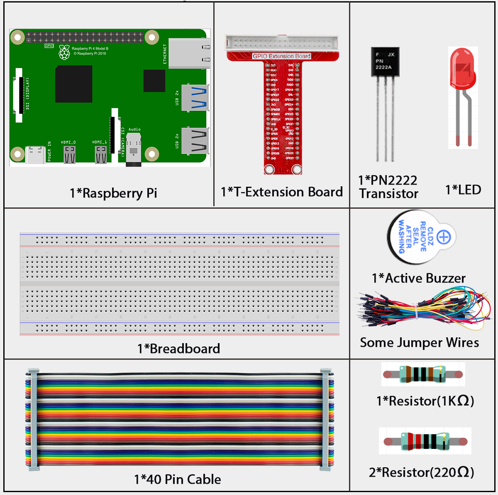
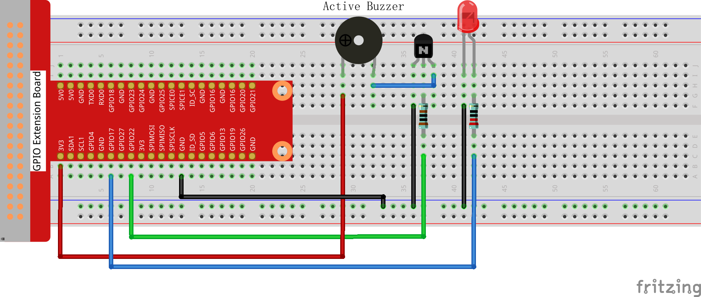

# 3.1.7 Morse Code Generator

## Introduction

In this course, we will make a manual alarm device. You can replace the toggle switch with a thermistor or a photosensitive sensor to make a temperature alarm or a light alarm.

## Components



## Connect

| T-Board Name | physical | wiringPi | BCM  |
| ------------ | -------- | -------- | ---- |
| GPIO17       | Pin 11   | 0        | 17   |
| GPIO22       | Pin 15   | 3        | 22   |




## Code

### For  C  Language User

Go to the code folder compile and run.

```sh
cd ~/super-starter-kit-for-raspberry-pi/c/3.1.11/
gcc 3.1.7_MorseCodeGenerator.c -lwiringPi
sudo ./a.out
```

<div class="warning" style="background-color: #E7F2FA; color=#6AB0DE; padding: 10px; border: 1px solid #333; border-radius: 5px;">
    NOTE: If you want to check the complete codes, you are suggested to use command `nano 3.1.7_MorseCodeGenerator.c` or `nano 3.1.7_MorseCodeGenerator.py`.
</div>

### For Python Language User

```sh
cd ~/super-starter-kit-for-raspberry-pi/Python/
python 3.1.7_MorseCodeGenerator.py
```

After the program runs, type a series of characters, and the buzzer and the LED will send the corresponding Morse code signals.

## Phenomenon


