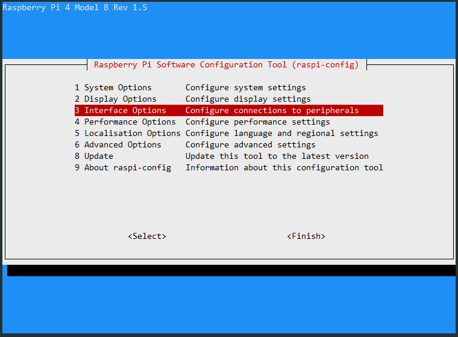
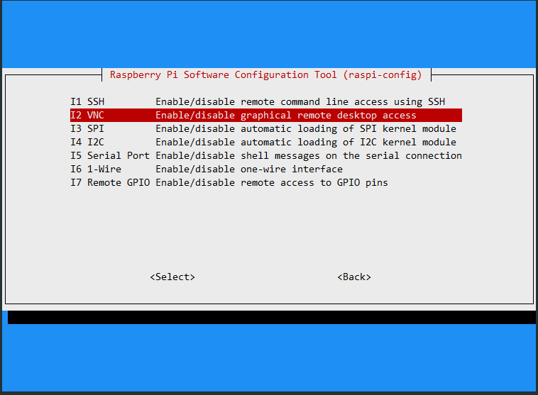
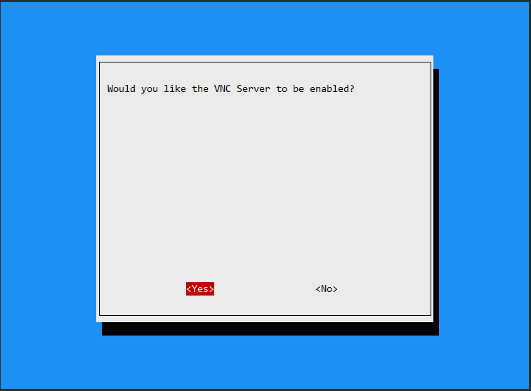
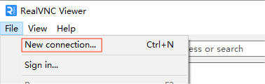
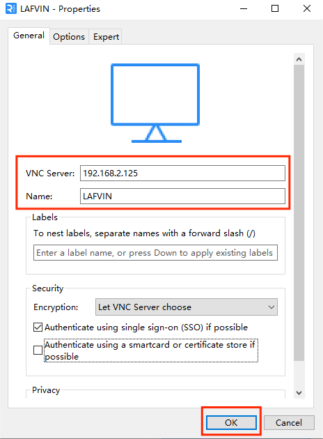
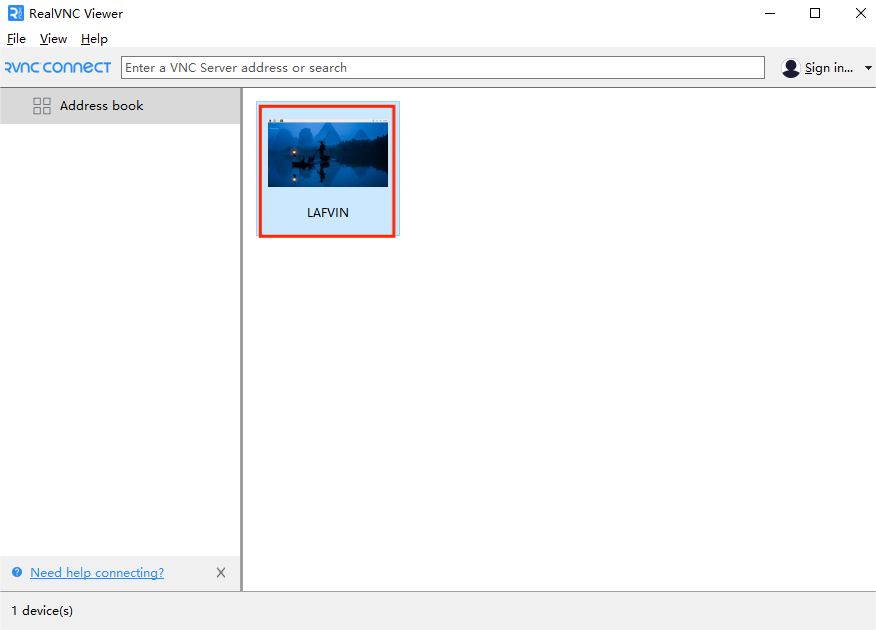
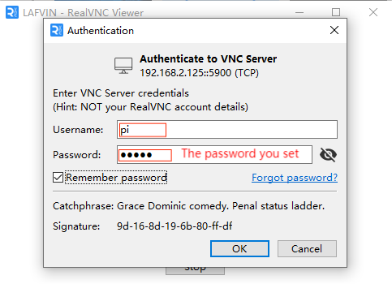

# Remote Desktop

We suggest you use VNC to remotely access the desktop of the Raspberry Pi.

## VNC

You can use the function of remote desktop through VNC.

**Enable VNC service**

The VNC service has been installed in the system. By default, VNC is disabled. You need to enable it in config.

This time we will use the Raspberry Pi 4B as a demonstration, please note that the positions may vary for other models.

**Step 1**

Input the following command:

```sh
sudo raspi-config
```


**Step 2**

Choose **3** **Interfacing Options** by press the down arrow key on your keyboard, then press the **Enter** key.



**Step 3**

**P2 VNC**




**Step 4**

Select **Yes -> OK -> Finish** to exit the configuration.



**Login to VNC 登录VNC**

**Step 1**

You need to download and install the [VNC Viewer](https://www.realvnc.com/en/connect/download/viewer/) on personal computer. After the installation is done, open it.

**Step 2**

Then select "**New connection**".



**Step 3**

Input IP address of Raspberry Pi and any **Name**.



**Step 4**

Double click the **connection** just created:



**Step 5**

Enter Username (**pi**) and Password.



**Step 6**

Now you can see the desktop of the Raspberry Pi:


That’s the end of the VNC part.

For related instructions, you can refer to [Set up Your Raspberry Pi](../preparation/Set_up_Your_Raspberry_Pi.md).

