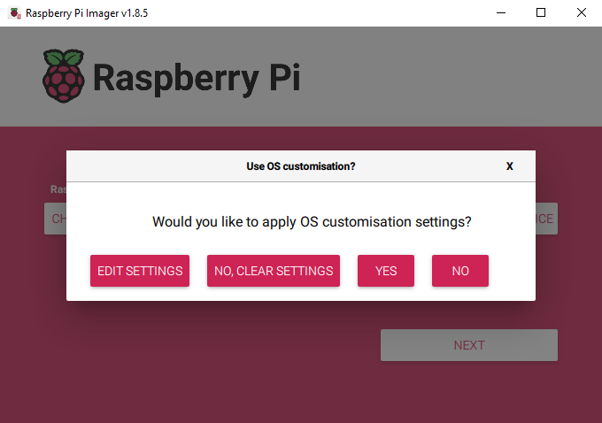
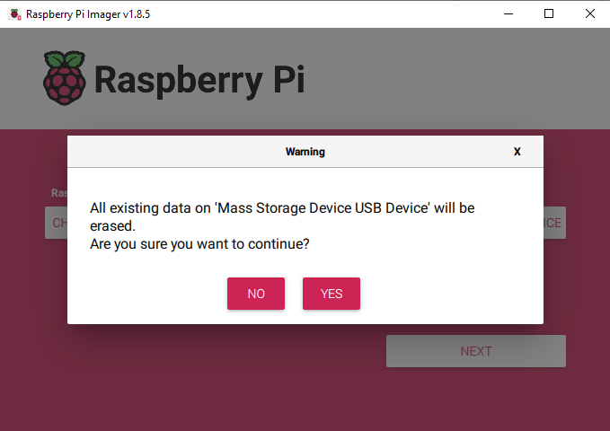
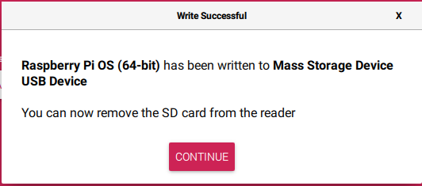

# Installing the OS (Common)

**Step 1**

Raspberry Pi have developed a graphical SD card writing tool that works on Mac OS, Ubuntu 18.04 and Windows, and is the easiest option for most users as it will download the image and install it automatically to the SD card.

Visit the [download page](https://www.raspberrypi.org/software/). Click on the link for the **Raspberry Pi Imager** that matches your operating system, when the download finishes, click it to launch the installer.

**Step 2**

When you launch the installer, your operating system may try to block you from running it. For example, on Windows I receive the following message:

If this pops up, click on **More info** and then **Run anyway**, then follow the instructions to install the Raspberry Pi Imager.

**Step 3**

Insert your SD card into the computer or laptop SD card slot.

**Step 4**

In the Raspberry Pi Imager, select the OS that you want to install and the SD card you would like to install it on.

 

    NOTE: You will need to be connected to the internet the first time.
That OS will then be stored for future offline use(lastdownload.cache, C:/Users/yourname/AppData/Local/Raspberry Pi/Imager/cache). So the next time you open the software, it will have the display “Released: date, cached on your computer”.

**Step 5**

Select the SD card you are using.

**Step 6**

Press **Ctrl+Shift+X** or click the **setting** icon to open the **Advanced options** page to enable SSH and set username and password.

    NOTE: - Now that the Raspberry Pi doesn’t have a default password, you will need to set it yourself. Also, the username can be changed.
    - For remote access, you will also need to enable SSH manually.

.png)

**wifi country** should be set the two-letter [ISO/IEC alpha2 code](https://en.wikipedia.org/wiki/ISO_3166-1_alpha-2#Officially_assigned_code_elements) for the country in which you are using your Raspberry Pi.

.png)

Then scroll down to complete the wifi configuration and click **SAVE**.

**Step 7**

When asked 「Would you like to apply OS customisation settings?」, press「YES」.

**Step 8**

If your SD card currently has any files on it, you may wish to back up these files first to prevent you from permanently losing them. If there is no file to be backed up, click **Yes**.

**Step 9**

After waiting for a period of time, the following window will appear to represent the completion of writing.

