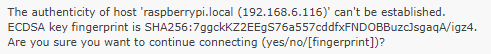
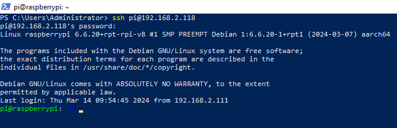

# Set up Your Raspberry Pi

## If You Have a Screen

If you have a screen, it will be easy for you to operate on the Raspberry Pi.

**Required Components**

- Any Raspberry Pi
- 1 * Power Adapter
- 1 * Micro SD card
- 1 * Screen Power Adapter
- 1 * HDMI cable
- 1 * Screen
- 1 * Mouse
- 1 * Keyboard

1. Insert the SD card you’ve set up with Raspberry Pi OS into the micro SD card slot on the underside of your Raspberry Pi.
2. Plug in the Mouse and Keyboard.
3. Connect the screen to Raspberry Pi’s HDMI port and make sure your screen is plugged into a wall socket and switched on.
4. Use the power adapter to power the Raspberry Pi. After a few seconds, the Raspberry Pi OS desktop will be displayed.

<div class="warning" style="background-color: #E7F2FA; color=#6AB0DE; padding: 10px; border: 1px solid #333; border-radius: 5px;">
    NOTE: If you use a Raspberry Pi 4, you need to connect the screen to the HDMI0 (nearest the power in port).
</div>


## If You Have No Screen

If you don’t have a monitor, you can remotely log into your Raspberry Pi.

You can apply the SSH command to open the Raspberry Pi’s Bash shell. Bash is the standard default shell for Linux. The shell itself is a command (instruction) when the user uses Unix/Linux. Most of what you need to do can be done through the shell.

If you’re not satisfied with using the command window to access your Raspberry Pi, you can also use the remote desktop feature to easily manage files on your Raspberry Pi using a GUI.

See below for detailed tutorials for each system.

If you’re a Windows user, you can use Windows PowerShell to login Raspberry Pi remotely.

1.Press the windows + R shortcut key in your keyboard to open the Run program. Then type powershell in the input box.


2. Check if your Raspberry Pi is on the same network by type in 

   ```
   ping <hostname>.local
   ```

   

If terminal prompts Ping request could not find host <hostname>.local, it is possible that the Raspberry Pi failed to connect to the network.lease check the network.

If you really can’t ping <hostname>.local, try to Get the IP address and ping <IP address> instead. (e.g., ping 192.168.2.118)

If multiple prompts like “Reply from <IP address>: bytes=32 time<1ms TTL=64” appear, it means your computer can access the Raspberry Pi.

3.Type in ssh <username>@<hostname>.local (or ssh <username>@<IP address>).

4.The following message may appear.



Input "yes".

5.Input the password you set before. (Mine is raspberry.)

<div class="warning" style="background-color: #E7F2FA; color=#6AB0DE; padding: 10px; border: 1px solid #333; border-radius: 5px;">
    NOTE: When you input the password, the characters do not display on window accordingly, which is normal. What you need is to input the correct password.
</div>



## Remote Desktop

If you’re not satisfied with using the command window to access your Raspberry Pi, you can also use the remote desktop feature to easily manage files on your Raspberry Pi using a GUI.

Here we use [VNC® Viewer](https://www.realvnc.com/en/connect/download/viewer/).

**Enable VNC service**

The VNC service has been installed in the system. By default, VNC is disabled. You need to enable it in config.

1. Input the following command:

   ```
   sudo raspi-config
   ```

2. Choose **3** **Interfacing Options** by press the down arrow key on your keyboard, then press the **Enter** key.

3. Then **P3 VNC**. 

4. Use the arrow keys on the keyboard to select **<Yes>** -> **<OK>** -> **<Finish>** to complete the setup.

**Login to VNC**

1. You need to download and install the [VNC Viewer](https://www.realvnc.com/en/connect/download/viewer/) on personal computer.
2. Open it once the installation is complete. Then, enter the host name or IP address and press Enter.
3. After entering your Raspberry Pi name and password, click **OK**.
4. Now you can see the desktop of the Raspberry Pi.