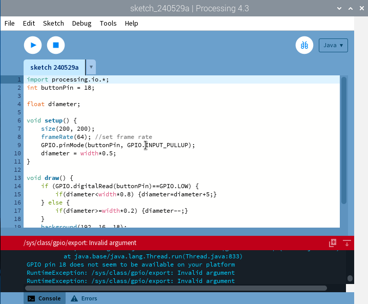
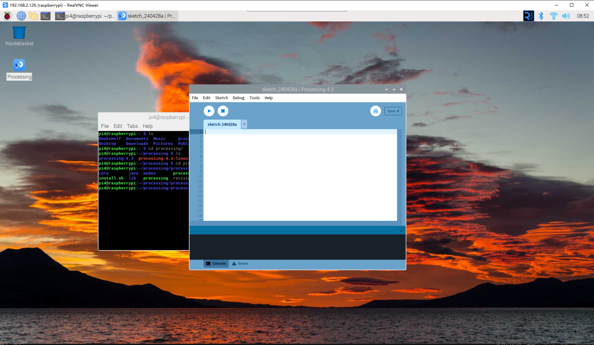
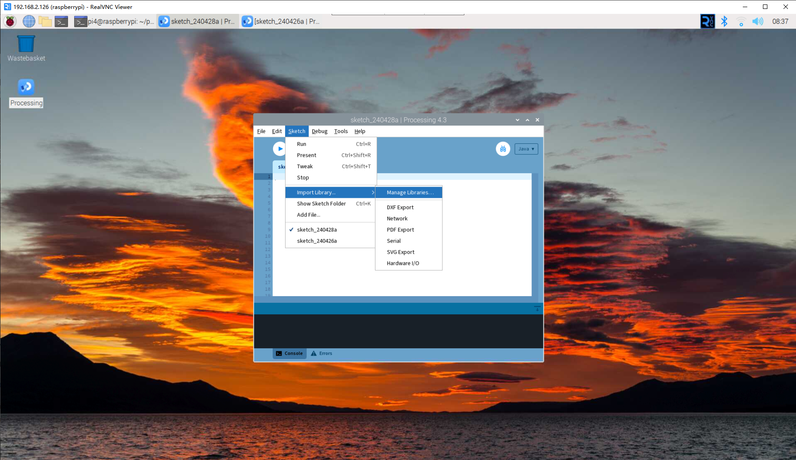
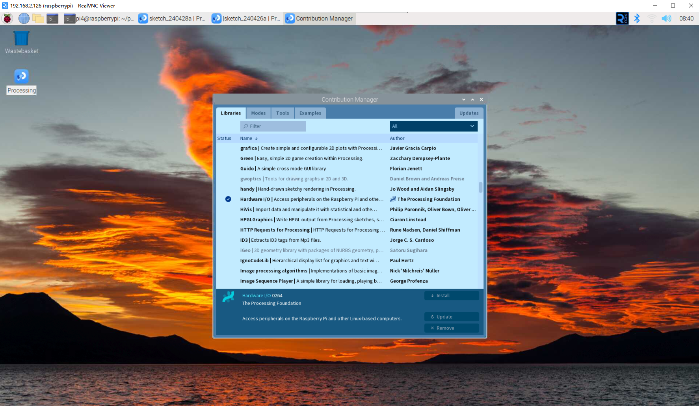

Play with Processing (for Pi 4)
=================================

What is Processing？
---------------------------

Processing is a simple programming environment created to make developing visually 
oriented applications easier, with an emphasis on animation and allowing users to 
provide instant feedback through interaction. The developers aimed to create a means for 
\"sketching\" ideas in code. Over the past decade, as its capabilities have expanded, 
Processing has also come to be used for more advanced production-level work in addition 
to its original sketching role. Originally built as a domain-specific extension of Java 
targeted toward artists and designers, Processing has evolved into a full-fledged design 
and prototyping tool used for large-scale installations, motion graphics, and complex data visualization.

Processing is based on Java, but because program elements in Processing are fairly simple, you can learn to use it even if you don't know any Java. If you're familiar with Java, it's best to forget that Processing has anything to do with Java for a while, until you get the hang of how the API works.

This text is from the tutorial, `Processing Overview <https://processing.org/tutorials/overview/>`_.

.. note:: 
    Please note, we recommend users of Raspberry Pi 4 to use the ``Debian 11 Bullseye`` system, as the newest ``Debian 12 Bookworm`` version may have some compatibility issues.

Install the Processing
------------------------------

.. note:: 

    Before you can use Processing, you need to access the Raspberry Pi desktop remotely `Remote Desktop <../Appendix/i2c_configuration.html>`_ or connect a display for the Raspberry Pi.

Go to https://processing.org/download and select Raspberry Pi. Download the software according to whether your Raspberry Pi system installation is ``32-bit or 64-bit``.

You will then download to a ``.tar.gz`` file that should be familiar to most Linux users. 
Download the file to your home directory, then open a terminal window and type:

.. code-block:: 

    tar xvfz processing-xxxx.tgz

(Replace xxxx with the rest of the file's name, which is the version number.)   This will create a folder named processing-x.x or something similar.   Then change to that directory:

.. code-block:: 

    cd processing-xxxx

and run it:

.. code-block:: 

    ./processing

With any luck, the main Processing window will now be visible.

Install Hardware I/O
--------------------

In order to use the Raspberry Pi's GPIO, you need to manually add a `Hardware I/O library <https://processing.org/reference/libraries/io/index.html>`_.

Click ``Sketch`` -> ``Import Library`` -> ``Add Library...`` 

Find Hardware I/O , select it, and then click Install. When done, a checkmark icon will appear.

Projects
---------------

.. toctree::
    draw_a_matchmaker
    hello_mouse
    blinking_dot
    clickable_dot
    clickable_color_blocks
    inflating_the_dot
    dot_on_the_swing
    metronome
    show_number
    drag_number
