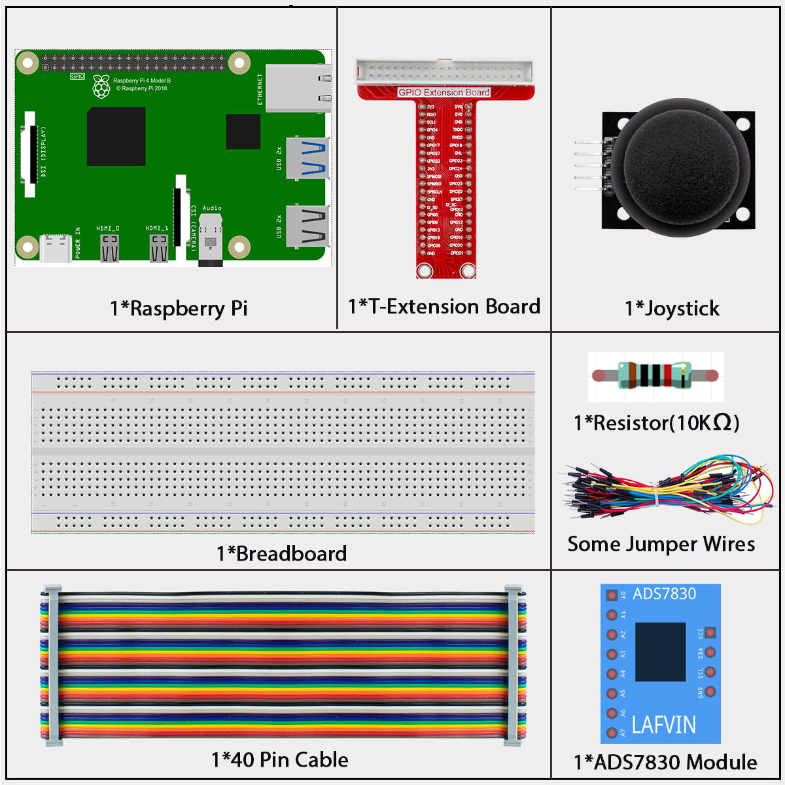

.. _py_pi5_joystick:

2.1.2 Joystick
==============

Introduction
------------

In this project, We're going to learn how joystick works. We manipulate
the Joystick and display the results on the screen.

Components
------------------------------

In this project, we need the following components. 

Schematic Diagram
-----------------

When the data of joystick is read, there are some differents between
axis: data of X and Y axis is analog, which need to use ADC0834 to
convert the analog value to digital value. Data of Z axis is digital, so
you can directly use the GPIO to read, or you can also use ADC to read.

.. image:: ../python_pi5/img/schematic/2.1.9_joystick_schematic_1.png

.. image:: ../python_pi5/img/schematic/2.1.9_joystick_schematic_2.png

Connect
-----------------------

**Step 1:** Build the circuit.

.. image:: ../python_pi5/img/connect/2.1.2.png

**Step 2:** Go to the folder of the code.

.. raw:: html

   <run></run>

.. code-block::

    cd ~/super-starter-kit-for-raspberry-pi/python-pi5

**Step 3:** Run.

.. raw:: html

   <run></run>

.. code-block::

    sudo python3 2.1.2_Joystick_zero.py

After the code runs, turn the Joystick, then the corresponding values of
x, y, Btn are displayed on screen.

**Code**

.. note::

    You can **Modify/Reset/Copy/Run/Stop** the code below. But before that, you need to go to  source code path like ``super-starter-kit-for-raspberry-pi/python-pi5``. After modifying the code, you can run it directly to see the effect.

.. raw:: html

    <run></run>

.. code-block:: python

    #!/usr/bin/env python3

    import RPi.GPIO as GPIO
    import time
    from ADCDevice import *

    Z_Pin = 12      # define Z_Pin
    adc = ADCDevice() # Define an ADCDevice class object

    def setup():
        global adc
        if(adc.detectI2C(0x48)): # Detect the ads7830
            adc = ADS7830()
        else:
            print("No correct I2C address found, \n"
            "Please use command 'i2cdetect -y 1' to check the I2C address! \n"
            "Program Exit. \n");
            exit(-1)
        GPIO.setmode(GPIO.BOARD)        
        GPIO.setup(Z_Pin,GPIO.IN,GPIO.PUD_UP)   # set Z_Pin to pull-up mode
    def loop():
        while True:     
            val_Z = GPIO.input(Z_Pin)       # read digital value of axis Z
            val_Y = adc.analogRead(0)           # read analog value of axis X and Y
            val_X = adc.analogRead(1)
            print ('value_X: %d ,\tvlue_Y: %d ,\tvalue_Z: %d'%(val_X,val_Y,val_Z))
            time.sleep(0.01)

    def destroy():
        adc.close()
        GPIO.cleanup()
    
    if __name__ == '__main__':
        print ('Program is starting ... ') # Program entrance
        setup()
        try:
            loop()
        except KeyboardInterrupt: # Press ctrl-c to end the program.
            destroy()

**Phenomenon**
---------------
.. image:: ../img/phenomenon/212.jpg
    :width: 800
    :align: center