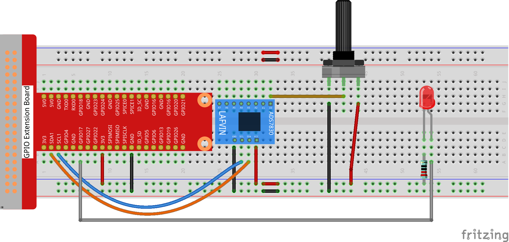

.. _2.1.4_py_pi5:

2.1.4 Potentiometer
===================

Introduction
------------

The ADC function can be used to convert analog signals to digital
signals, and in this experiment, ADC0834 is used to get the function
involving ADC. Here, we implement this process by using potentiometer.
Potentiometer changes the physical quantity -- voltage, which is
converted by the ADC function.

Components
------------------------------

In this project, we need the following components. 

.. image:: ../python_pi5/img/list/2.1.4_potentiometer_list.png

.. It's definitely convenient to buy a whole kit, here's the link: 

Schematic Diagram
-----------------

.. image:: ../python_pi5/img/schematic/2.1.4_potentiometer_second_1.png

.. image:: ../python_pi5/img/schematic/2.1.4_potentiometer_second_2.png

Experimental Procedures
-----------------------

**Step 1:** Build the circuit.

.. note::
    Please place the chip by referring to the corresponding position
    depicted in the picture. Note that the grooves on the chip should be on
    the left when it is placed.

**Step 2:** Open the code file

.. raw:: html

   <run></run>

.. code-block::

    cd ~/super-starter-kit-for-raspberry-pi/python-pi5/python-pi5

**Step 3:** Run.

.. raw:: html

   <run></run>

.. code-block::

    sudo python3 2.1.4_Potentiometer_zero.py

After the code runs, rotate the knob on the potentiometer, the intensity
of LED will change accordingly.

**Code**

.. note::

    You can **Modify/Reset/Copy/Run/Stop** the code below. But before that, you need to go to  source code path like ``super-starter-kit-for-raspberry-pi/python-pi5/python-pi5``. After modifying the code, you can run it directly to see the effect.

.. raw:: html

    <run></run>

.. code-block:: python

   #!/usr/bin/env python3

   import RPi.GPIO as GPIO
   import time
   from ADCDevice import *

   # Initialize a PWM LED on GPIO pin 22
   ledPin = 11
   adc = ADCDevice() # Define an ADCDevice class object

   def setup():
        global adc
        if(adc.detectI2C(0x48)): # Detect the ads7830
            adc = ADS7830()
        else:
            print("No correct I2C address found, \n"
            "Please use command 'i2cdetect -y 1' to check the I2C address! \n"
            "Program Exit. \n");
            exit(-1)
        global p
        GPIO.setmode(GPIO.BOARD)
        GPIO.setup(ledPin,GPIO.OUT)
        p = GPIO.PWM(ledPin,1000)
        p.start(0)

   def loop():
        while True:
            value = adc.analogRead(0)    # read the ADC value of channel 0
            p.ChangeDutyCycle(value*100/255)        # Mapping to PWM duty cycle
            voltage = value / 255.0 * 3.3  # calculate the voltage value
            print ('ADC Value : %d, Voltage : %.2f'%(value,voltage))
            time.sleep(0.03)

   def destroy():
       p.stop()  # stop PWM  
       GPIO.cleanup()
       adc.close()
    
    if __name__ == '__main__':   # Program entrance
        print ('Program is starting ... ')
        try:
            setup()
            loop()
        except KeyboardInterrupt: # Press ctrl-c to end the program.
            destroy()

**Code Explanation**

#. 
    In this code, a custom Python module "ADCDevice" is used. It contains the method of utilizing the ADC 
    Module in this project, through which the ADC Module can easily and quickly be used. In the code, you need 
    to first create an ADCDevice object adc.
    
   .. code-block:: python

      adc = ADCDevice() # Define an ADCDevice class object

#. Then in setup(), use detecticIC(addr), the member function of ADCDevice, to detect the I2C module in the circuit. Different modules have different I2C addresses. Therefore, according to the address, we can determine which ADC Module is in the circuit. When the correct module is detected, a device specific class object is created and assigned to adc. The default address of  ADS7830 is 0x48.

   .. code-block:: python

     def setup():
        global adc
        if(adc.detectI2C(0x48)): # Detect the ads7830
            adc = ADS7830()
        else:
            print("No correct I2C address found, \n"
            "Please use command 'i2cdetect -y 1' to check the I2C address! \n"
            "Program Exit. \n");
            exit(-1)
        global p
        GPIO.setmode(GPIO.BOARD)
        GPIO.setup(ledPin,GPIO.OUT)
        p = GPIO.PWM(ledPin,1000)
        p.start(0)

#. When you have a class object of a specific device, you can get the ADC value of the specified channel by calling the member function of this class, analogRead(chn). In loop(), get the ADC value of potentiometer.

   .. code-block:: python

       value = adc.analogRead(0) # read the ADC value of channel 0

#. Then according to the formula, the voltage value is calculated and displayed on the terminal monitor.

   .. code-block:: python

        voltage = value / 255.0 * 3.3 # calculate the voltage value
        print ('ADC Value : %d, Voltage : %.2f'%(value,voltage))
        time.sleep(0.1)
        
**Phenomenon**
---------------
.. image:: ../img/phenomenon/214.jpg
    :width: 800
    :align: center