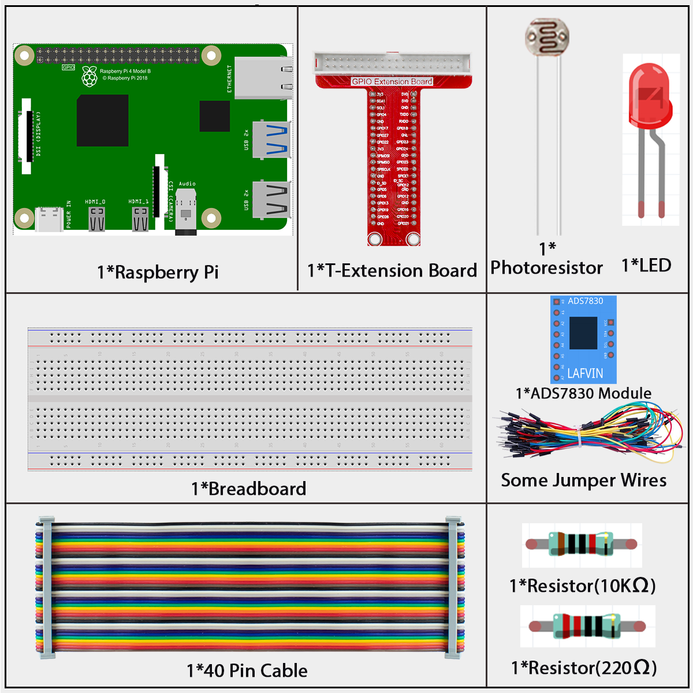
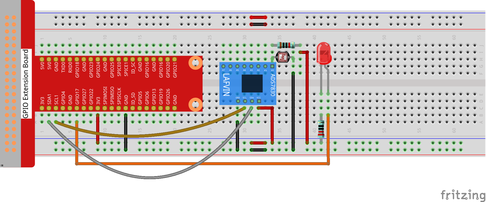

.. _2.2.1_py_pi5:

2.2.1 Photoresistor
===================

Introduction
------------

Photoresistor is a commonly used component of ambient light intensity in
life. It helps the controller to recognize day and night and realize
light control functions such as night lamp. This project is very similar
to potentiometer, and you might think it changing the voltage to sensing
light.

Components
------------------------------

In this project, we need the following components. 

Schematic Diagram
-----------------

.. image:: ../python_pi5/img/schematic/2.2.1_photoresistor_schematic_1.png

.. image:: ../python_pi5/img/schematic/2.2.1_photoresistor_schematic_2.png

Connect
-----------------------

**Step 1:** Build the circuit.

**Step 2:** Go to the folder of the code.

.. raw:: html

   <run></run>

.. code-block::

    cd ~/super-starter-kit-for-raspberry-pi/python-pi5/

**Step 3:** Run the executable file.

.. raw:: html

   <run></run>

.. code-block::

    sudo python3 2.2.1_Photoresistor_zero.py

When the code is running, the brightness of the LED will change according to the light intensity sensed by the photoresistor.

**Code**

.. note::

    You can **Modify/Reset/Copy/Run/Stop** the code below. But before that, you need to go to  source code path like ``raphael-kit/python-pi5``. After modifying the code, you can run it directly to see the effect.

.. raw:: html

    <run></run>

.. code-block:: python

    #!/usr/bin/env python3
    import RPi.GPIO as GPIO
    import time
    from ADCDevice import *

    ledPin = 11 # define ledPin
    adc = ADCDevice() # Define an ADCDevice class object

    def setup():
        global adc
            if(adc.detectI2C(0x48)): # Detect the ads7830
                adc = ADS7830()
            else:
                print("No correct I2C address found, \n"
                "Please use command 'i2cdetect -y 1' to check the I2C address! \n"
                "Program Exit. \n");
            exit(-1)
        global p
        GPIO.setmode(GPIO.BOARD)
        GPIO.setup(ledPin,GPIO.OUT)   # set ledPin to OUTPUT mode
        GPIO.output(ledPin,GPIO.LOW)
    
        p = GPIO.PWM(ledPin,1000) # set PWM Frequence to 1kHz
        p.start(0)
    
    def loop():
        while True:
            value = adc.analogRead(0)    # read the ADC value of channel 0
            p.ChangeDutyCycle(value*100/255)
            voltage = value / 255.0 * 3.3
            print ('ADC Value : %d, Voltage : %.2f'%(value,voltage))
            time.sleep(0.01)

    def destroy():
        adc.close()
        p.stop()  # stop PWM
        GPIO.cleanup()
    
    if __name__ == '__main__':   # Program entrance
        print ('Program is starting ... ')
        setup()
        try:
            loop()
        except KeyboardInterrupt:  # Press ctrl-c to end the program.
            destroy()
        

**Phenomenon**
---------------
.. image:: ../img/phenomenon/221.jpg
    :width: 800
    :align: center