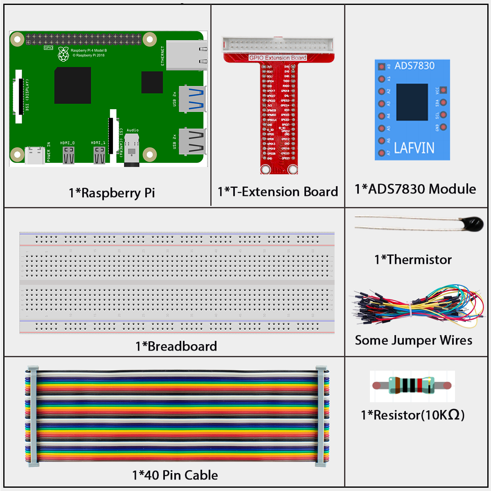
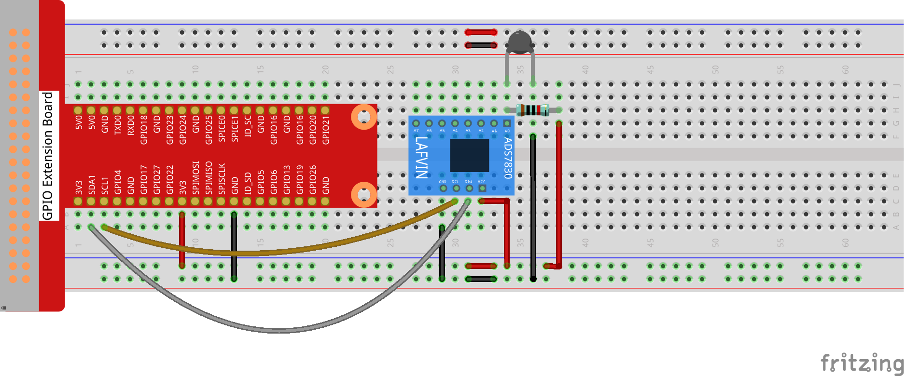

.. _2.2.2_py_pi5:

2.2.2 Thermistor
================

Introduction
------------

Just like photoresistor can sense light, thermistor is a temperature
sensitive electronic device that can be used for realizing functions of
temperature control, such as making a heat alarm.

Components
------------------------------

In this project, we need the following components. 

Schematic Diagram
-----------------

.. image:: ../python_pi5/img/schematic/2.2.2_thermistor_schematic_1.png

.. image:: ../python_pi5/img/schematic/2.2.2_thermistor_schematic_2.png

Connect
-----------------------

**Step 1:** Build the circuit.

**Step 2:** Go to the folder of the code.

.. raw:: html

   <run></run>

.. code-block:: 

    cd ~/super-starter-kit-for-raspberry-pi/python-pi5/python-pi5

**Step 3:** Run the executable file

.. raw:: html

   <run></run>

.. code-block:: 

    sudo python3 2.2.2_Thermistor_zero.py

With the code run, the thermistor detects ambient temperature which will
be printed on the screen once it finishes the program calculation.

**Code**

.. note::

    You can **Modify/Reset/Copy/Run/Stop** the code below. But before that, you need to go to  source code path like ``super-starter-kit-for-raspberry-pi/python-pi5/python-pi5``. After modifying the code, you can run it directly to see the effect.

.. raw:: html

    <run></run>

.. code-block:: python

   #!/usr/bin/env python3

    import RPi.GPIO as GPIO
    import time
    import math
    from ADCDevice import *

    adc = ADCDevice() # Define an ADCDevice class object

    def setup():
        global adc
        if(adc.detectI2C(0x48)): # Detect the ads7830
            adc = ADS7830()
        else:
            print("No correct I2C address found, \n"
            "Please use command 'i2cdetect -y 1' to check the I2C address! \n"
            "Program Exit. \n");
            exit(-1)
        
    def loop():
        while True:
            value = adc.analogRead(0)        # read ADC value A0 pin
            voltage = value / 255.0 * 3.3        # calculate voltage
            Rt = 10 * voltage / (3.3 - voltage)    # calculate resistance value of thermistor
            tempK = 1/(1/(273.15 + 25) + math.log(Rt/10)/3950.0) # calculate temperature (Kelvin)
            tempC = tempK -273.15        # calculate temperature (Celsius)
            print ('ADC Value : %d, Voltage : %.2f, Temperature : %.2f'%(value,voltage,tempC))
            time.sleep(0.01)

    def destroy():
        adc.close()
        GPIO.cleanup()
    
    if __name__ == '__main__':  # Program entrance
        print ('Program is starting ... ')
        setup()
        try:
            loop()
        except KeyboardInterrupt: # Press ctrl-c to end the program.
            destroy()

**Phenomenon**
---------------
.. image:: ../img/phenomenon/222.jpg
    :width: 800
    :align: center
