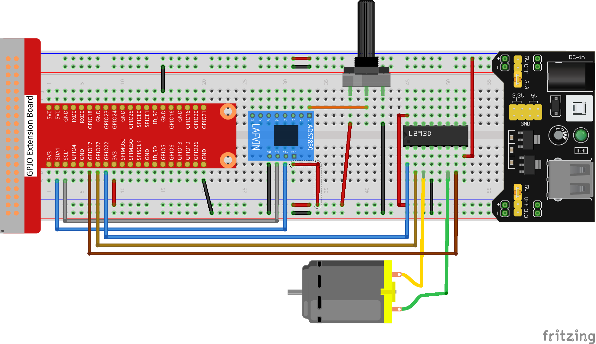

.. _py_pi5_fan:

3.1.4 Adjustable Fan
=========================

Introduction
-----------------

For this project, we will be constructing an adjustable fan system by utilizing 
components such as the ADS7830 analog-to-digital converter, the L293D motor 
driver chip, a potentiometer for variable resistance, and a motor. By integrating 
these components together, we will create a fan whose speed can be manually 
adjusted and controlled through the potentiometer input.

Components
------------------------------

In this project, we need the following components.

.. image:: ../python_pi5/img/list/4.1.10_smart_fan_list.png
    :width: 800
    :align: center

Schematic Diagram
------------------------

============ ======== ======== ===
T-Board Name physical wiringPi BCM
GPIO17       Pin 11   0        17
GPIO18       Pin 12   1        18
GPIO27       Pin 13   2        27
GPIO22       Pin 15   3        22
GPIO5        Pin 29   21       5
GPIO6        Pin 31   22       6
GPIO13       Pin 33   23       13
============ ======== ======== ===

.. image:: ../python_pi5/img/schematic/4.1.10_smart_fan_schematic.png
   :align: center

Connect
-----------------------------

**Step 1:** Build the circuit.

.. note::
    The power module can apply a 9V battery with the 9V Battery
    Buckle in the kit. Insert the jumper cap of the power module into the 5V
    bus strips of the breadboard.

.. image:: ../python_pi5/img/4.1.10_smart_fan_battery.jpeg
   :align: center

**Step 2**: Get into the folder of the code.

.. raw:: html

   <run></run>

.. code-block:: 

    cd ~/super-starter-kit-for-raspberry-pi/python-pi5

**Step 3**: Run.

.. raw:: html

   <run></run>

.. code-block:: 

    sudo python3 3.1.4_AdjustableFan_zero.py

After the program is executed,you can use the Poten-tiometer to control the DC 
Motor.When the Potentiome-ter is at the midpoint position,the DC Motor will STOP,
and when the Potentiometer is turned in either direction of this midpoint,the DC 
Motor speed increases until it reaches the endpoint where the DC Motor achieves 
its maximum speed.When the Potentiometer is turned "Left"of the midpoint the DC 
Motor will ROTATE in one direction and when turned "Right" the DC Motor will 
ROTATE in the opposite direction.You will also see the ADC value of the 
potentiometer displayed in the Terminal with the motor direction and the PWM 
duty cycle used to control the DC Motor's speed.

Code
--------

.. note::
    You can **Modify/Reset/Copy/Run/Stop** the code below. But before that, you need to go to  source code path like ``super-starter-kit-for-raspberry-pi/python-pi5``. After modifying the code, you can run it directly to see the effect.

.. raw:: html

    <run></run>

.. code-block:: python

   #!/usr/bin/env python3

    import RPi.GPIO as GPIO
    import time
    from ADCDevice import *

    # define the pins connected to L293D 
    motoRPin1 = 13
    motoRPin2 = 11
    enablePin = 15
    adc = ADCDevice() # Define an ADCDevice class object

    def setup():
        global adc
        if(adc.detectI2C(0x48)): # Detect the ads7830
            adc = ADS7830()
        else:
            print("No correct I2C address found, \n"
            "Please use command 'i2cdetect -y 1' to check the I2C address! \n"
            "Program Exit. \n");
            exit(-1)
        global p
        GPIO.setmode(GPIO.BOARD)   
        GPIO.setup(motoRPin1,GPIO.OUT)   # set pins to OUTPUT mode
        GPIO.setup(motoRPin2,GPIO.OUT)
        GPIO.setup(enablePin,GPIO.OUT)
        
        p = GPIO.PWM(enablePin,1000) # creat PWM and set Frequence to 1KHz
        p.start(0)

    # mapNUM function: map the value from a range of mapping to another range.
    def mapNUM(value,fromLow,fromHigh,toLow,toHigh):
        return (toHigh-toLow)*(value-fromLow) / (fromHigh-fromLow) + toLow
	
    # motor function: determine the direction and speed of the motor according to the input ADC value input
    def motor(ADC):
        value = ADC -128
        if (value > 0):  # make motor turn forward
            GPIO.output(motoRPin1,GPIO.HIGH)  # motoRPin1 output HIHG level
            GPIO.output(motoRPin2,GPIO.LOW)   # motoRPin2 output LOW level
            print ('Turn Forward...')
        elif (value < 0): # make motor turn backward
            GPIO.output(motoRPin1,GPIO.LOW)
            GPIO.output(motoRPin2,GPIO.HIGH)
            print ('Turn Backward...')
        else :
            GPIO.output(motoRPin1,GPIO.LOW)
            GPIO.output(motoRPin2,GPIO.LOW)
            print ('Motor Stop...')
        p.start(mapNUM(abs(value),0,128,0,100))
        print ('The PWM duty cycle is %d%%\n'%(abs(value)*100/127))   # print PMW duty cycle.

    def loop():
        while True:
            value = adc.analogRead(0) # read ADC value of channel 0
            print ('ADC Value : %d'%(value))
            motor(value)
            time.sleep(0.2)

    def destroy():
        p.stop()  # stop PWM
        GPIO.cleanup()
    
    if __name__ == '__main__':  # Program entrance
        print ('Program is starting ... ')
        setup()
        try:
            loop()
        except KeyboardInterrupt: # Press ctrl-c to end the program.
            destroy()

Code Explanation
---------------------

#. This code imports the RPi.GPIO module for GPIO control, the time module for delays, and the ADCDevice module.

   .. code-block:: python

       #!/usr/bin/env python3

       import RPi.GPIO as GPIO
       import time
       from ADCDevice import *

#. The program first declares a global variable named adc. Then, it uses the detectI2C() function to check if the I2C address of the ADC IC (ads7830) is correct. If the address is correct, it initializes the ADC object; otherwise, it prints an error message. Next, the program sets the GPIO pin numbering mode to BOARD. After that, it sets the motor driver pins (motoRPin1, motoRPin2) as outputs, and also sets the enable pin connected to PWM as an output. The program also creates a PWM object named 'p' on the enable pin, setting its frequency to 1000Hz. Finally, the program turns off the PWM by setting its duty cycle to 0.

   .. code-block:: python

       def setup():
        global adc
        if(adc.detectI2C(0x48)): # Detect the ads7830
            adc = ADS7830()
        else:
            print("No correct I2C address found, \n"
            "Please use command 'i2cdetect -y 1' to check the I2C address! \n"
            "Program Exit. \n");
            exit(-1)
        global p
        GPIO.setmode(GPIO.BOARD)   
        GPIO.setup(motoRPin1,GPIO.OUT)   # set pins to OUTPUT mode
        GPIO.setup(motoRPin2,GPIO.OUT)
        GPIO.setup(enablePin,GPIO.OUT)
        
        p = GPIO.PWM(enablePin,1000) # creat PWM and set Frequence to 1KHz
        p.start(0)

#. This code defines a mapNUM function that linearly maps a value from one numeric range to another numeric range.

   .. code-block:: python

       def mapNUM(value,fromLow,fromHigh,toLow,toHigh):
        return (toHigh-toLow)*(value-fromLow) / (fromHigh-fromLow) + toLow

#. This code defines a motor function that uses the ADC input value to control the direction (forward/backward/stop) and speed of a motor by setting GPIO pin levels and mapping the ADC value to a PWM duty cycle value.

   .. code-block:: python

        def motor(ADC):
            value = ADC -128
            if (value > 0):  # make motor turn forward
            GPIO.output(motoRPin1,GPIO.HIGH)  # motoRPin1 output HIHG level
            GPIO.output(motoRPin2,GPIO.LOW)   # motoRPin2 output LOW level
            print ('Turn Forward...')
        elif (value < 0): # make motor turn backward
            GPIO.output(motoRPin1,GPIO.LOW)
            GPIO.output(motoRPin2,GPIO.HIGH)
            print ('Turn Backward...')
        else :
            GPIO.output(motoRPin1,GPIO.LOW)
            GPIO.output(motoRPin2,GPIO.LOW)
            print ('Motor Stop...')
        p.start(mapNUM(abs(value),0,128,0,100))
        print ('The PWM duty cycle is %d%%\n'%(abs(value)*100/127))   # print PMW duty cycle.

#. This defines a loop function that enters an infinite loop where it repeatedly reads the analog value from ADC channel 0, prints the ADC value, calls the previously defined motor function with that value to control the motor's direction and speed, and then waits 0.2 seconds before repeating the loop.

   .. code-block:: python

        def loop():
            while True:
                value = adc.analogRead(0) # read ADC value of channel 0
                print ('ADC Value : %d'%(value))
                motor(value)
                time.sleep(0.2)

**Phenomenon**
---------------
.. image:: ../img/phenomenon/314.gif
    :width: 800
    :align: center