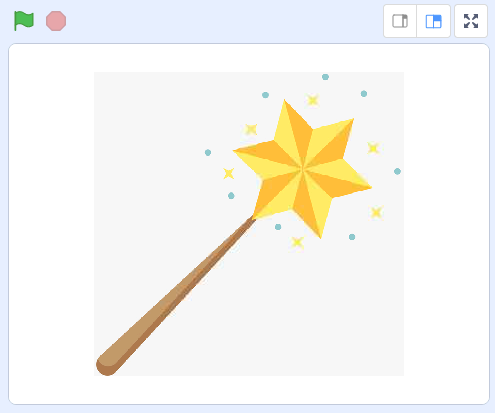
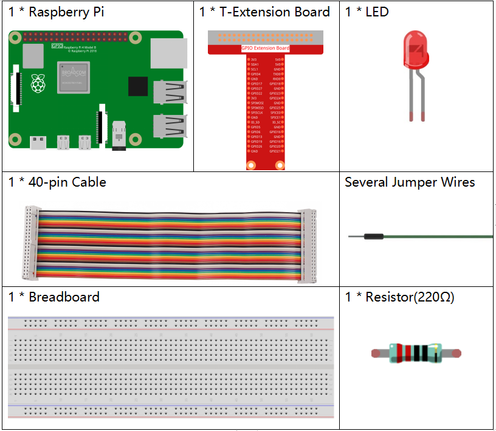
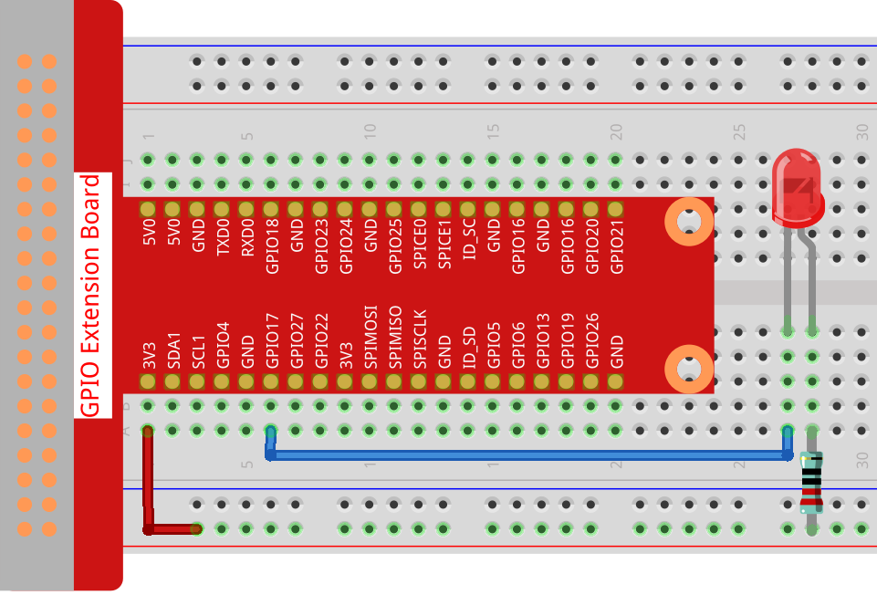
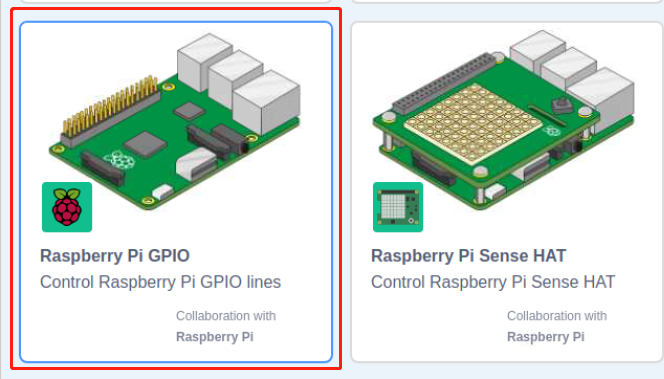
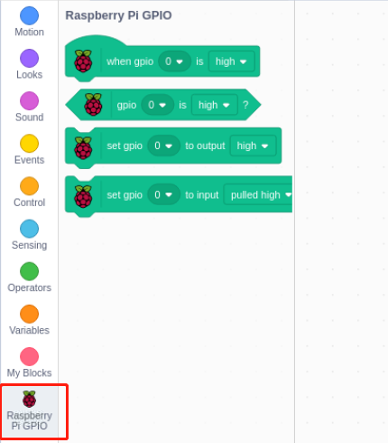

# 1.1 Wand

Today we will use LED, Raspberry Pi and Scratch to make a fun game. When we wave the magic wand, the LED will blink.

## Required Components

## Build the Circuit

## Add GPIO Extension

Click on the **Add Extension** button in the bottom left corner，then add the **Raspberry Pi GPIO**, an extension we use for all of our Scratch projects.

## Load the Code and See What Happens

Load the code file from your computer(`home/pi/davinci-kit-for-raspberry-pi/scratch/code`) to Scratch 3.

 

After clicking the magic wand in the stage area, you will see the LED will blink for two seconds.

## Tips on Sprite

Click on the **Upload Sprite**.

Upload **Wand.png** from the `home/pi/davinci-kit-for-raspberry-pi/scratch/picture` path to Scratch 3.

Finally, delete the **Sprite1**.

## Tips on Codes[¶](https://docs.sunfounder.com/projects/davinci-kit/en/latest/scratch/scratch_1.1_wand.html#tips-on-codes)

This is an event block whose trigger condition is to click on the green flag on the stage. A trigger event is required at the beginning of all codes, and you can select other trigger events in the **Events** category of the **block palette**.

For example, we can now change the trigger event to a click on the sprite.

This is a block with a set number of cycles. When we fill in the number 10, the events in the block will be executed 10 times.

This block is used to pause the program for a period of time in seconds.

Since the BCM naming method is used in Scratch, this code is setting GPIO17(BCM17) as 0V (low level). Since the cathode of LED is connected to GPIO17, thus the LED will light up. On the contrary, if you set GPIO(BCM17) as high, the LED will turn off.

