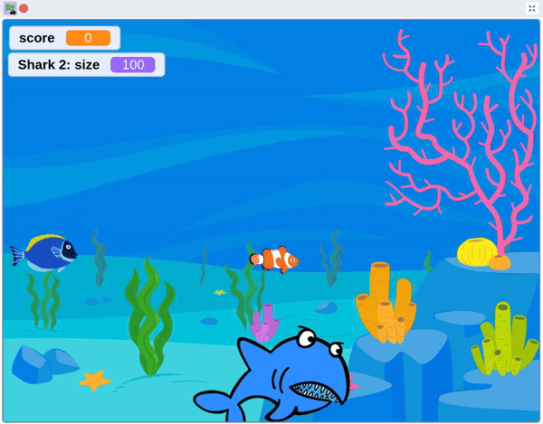
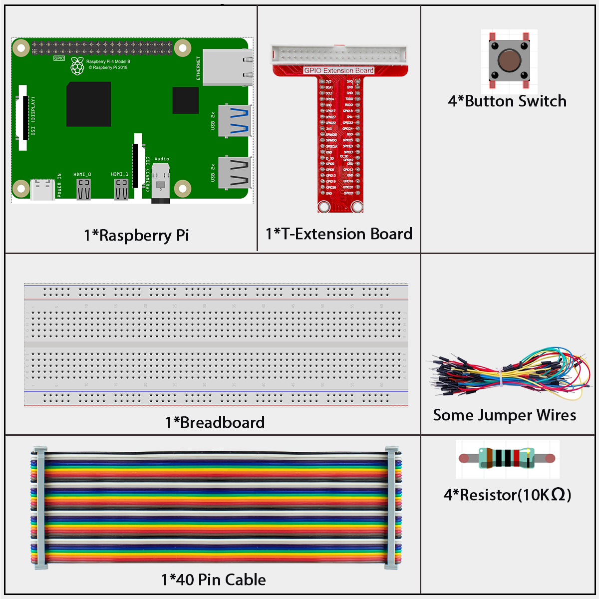
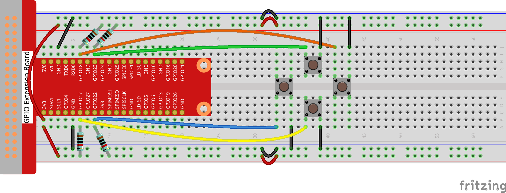
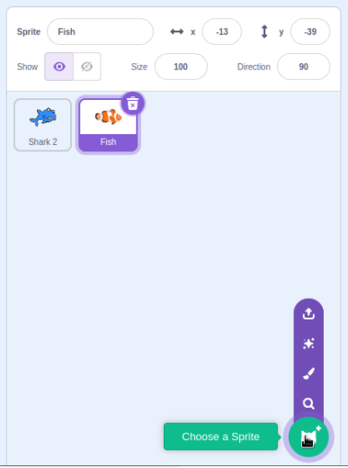
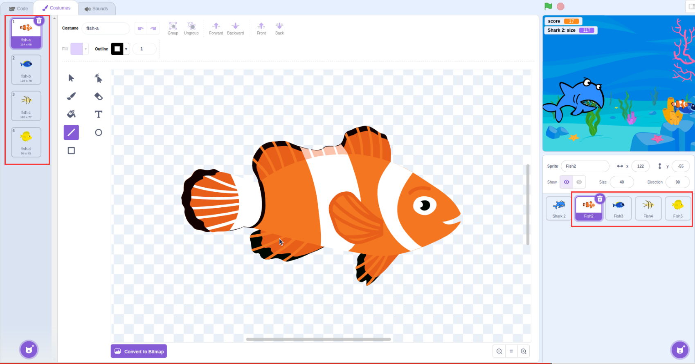
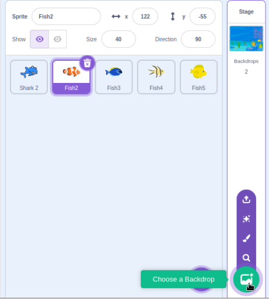
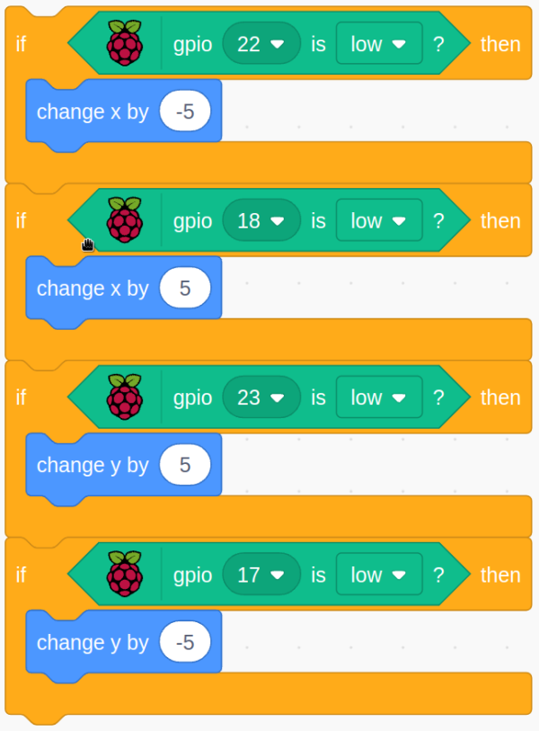
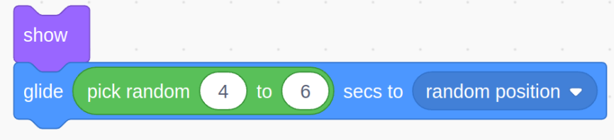

# 1.10 Shark Predation

Click the green flag to start running code. Control sharks to kill small fish with keys. Has kill different small fish to get different scores.

## Required Components

In this project, we need the following components.

## Build the Circuit

## Load the Code and See What Happens

Load the code file (`1.10_shark_predation.sb3`) to Scratch 3.

Click the green flag to start running code. Control sharks to kill small fish with keys. Has kill different small fish to get different scores.

## Tips on Sprite

Select the sprites "**Shark 2**", "**Fish**".

Duplicate 4 Fish Sprite, each Fish Sprite chooses different Costumes.

## Tips on Stage

Choose Backdrop **Underwater1**

## Tips on Codes

When the button is pressed, the **Shark 2** Sprite changes 5 units in the corresponding direction position

Modify the score value each time

Modify the time parameters to change the speed of small fish. This is related to the difficulty of the game.

