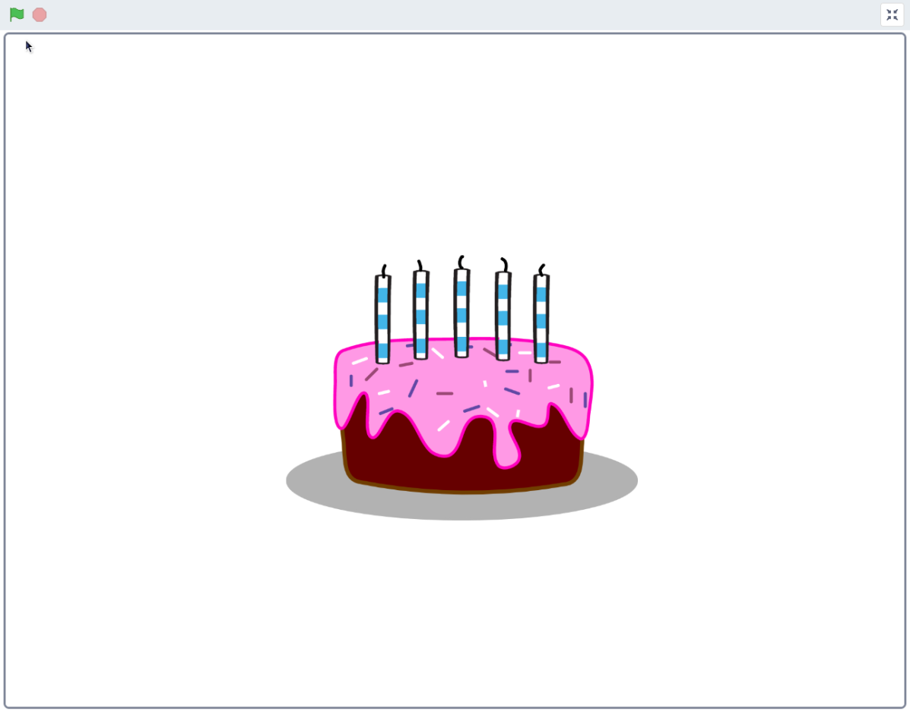
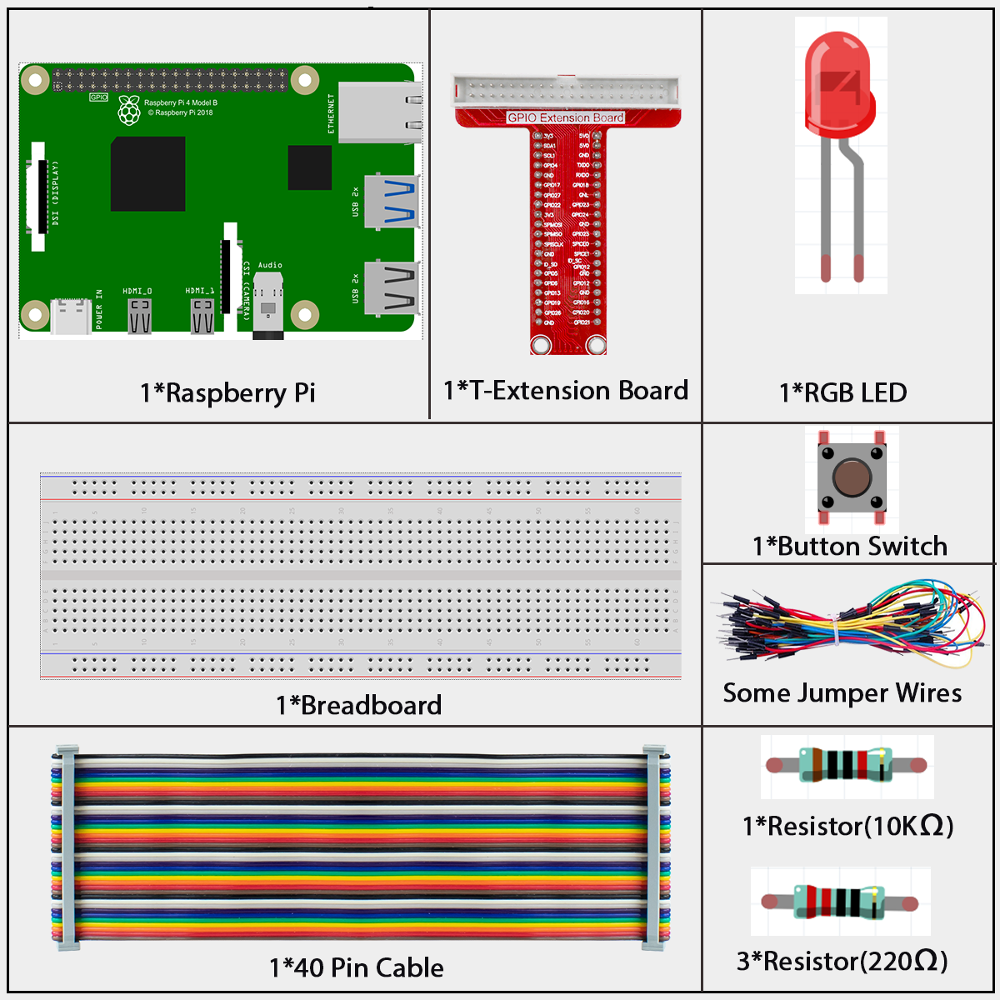
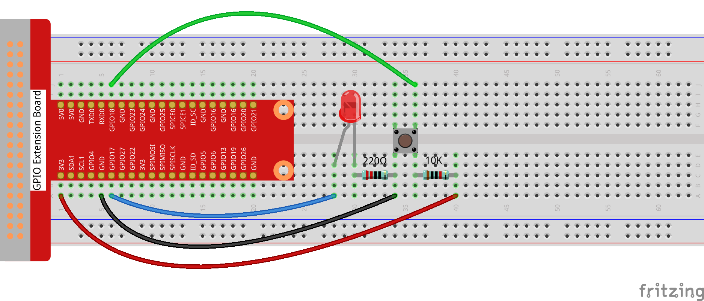
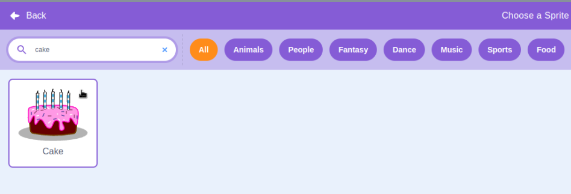
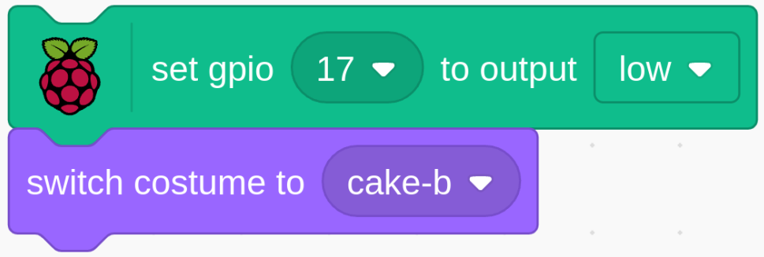
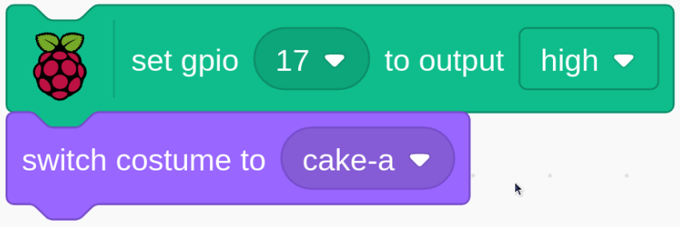
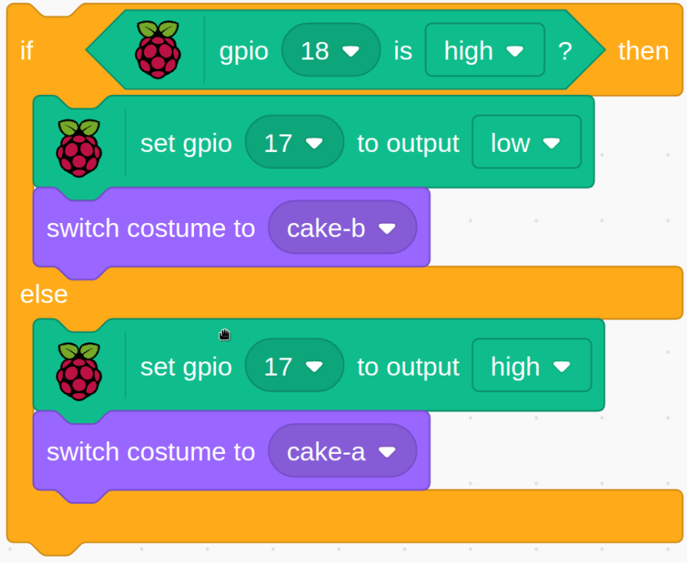

# 1.3 Happy Birthday

When the button is pressed, the candles on the cake light up; when the button is released, the candles on the cake go out.

## Required Components

## Build the Circuit

## Load the Code and See What Happens

After loading the code file (`1.3_happy_birthday.sb3`) into Scratch 3.Click the green flag.When the button is pressed, the candles on the cake light up; when the button is released, the candles on the cake go out.

## Tips on Sprite

Click on the **Choose a Sprite**.

Enter **cake**, click search, and select the Sprite named Cake.

## Tips on Codes

LED lights go out when the GPIO17 outputs LOW. Cake sprite switch to Cake B (the candle is not lit)

When the GPIO17 outputs high, the LED light is on. Cake sprite switch to Cake A (candle is lit)

When the keys are pressed, GPIO18 is LOW. When the keys are not pressed, GPIO18 is HIGH.

