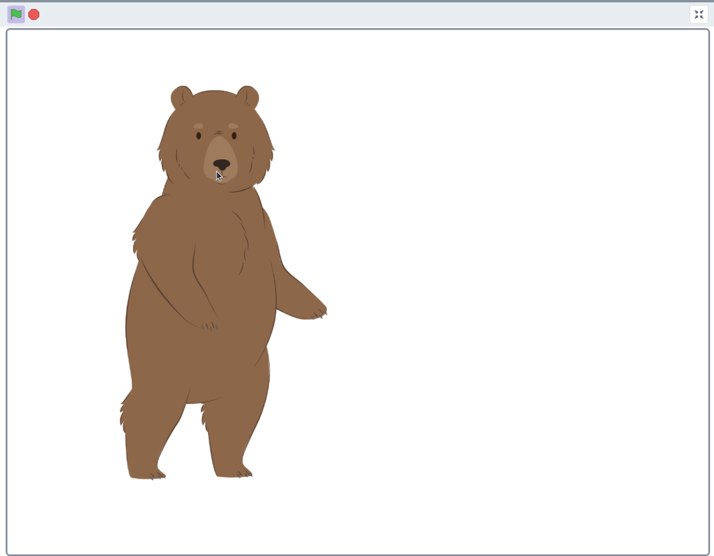
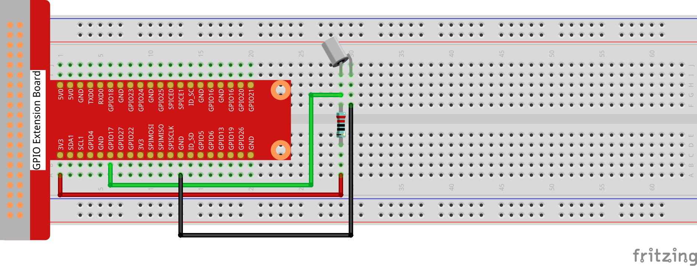
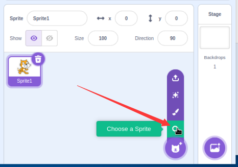
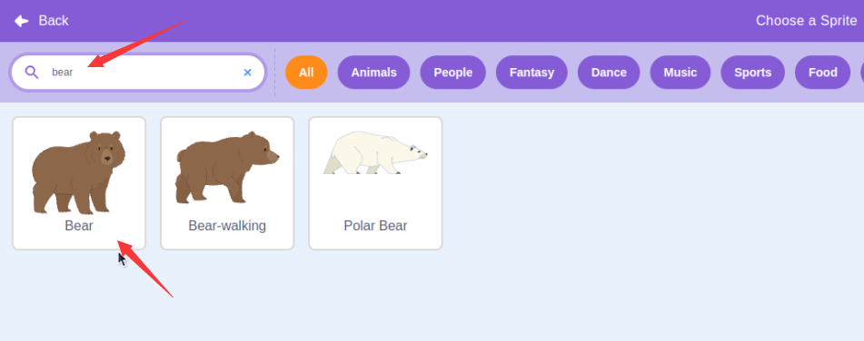
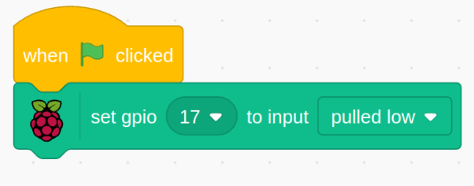
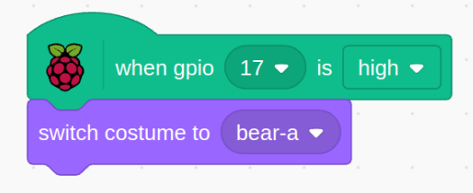

# 1.4 Bear is Coming

In this project, we will use a tilt switch to control whether a brown bear stands up or lies down.

## Required Components

## Build the Circuit

## Load the Code and See What Happens

**Load the code file (**`1.4_Bear_is_Coming.sb3`) to Scratch 3.

When the tilt switch is placed upright, the brown bear is standing. If you tilt it, the tumbler will also fall. Place it upright again, and the brown bear will stand up again.

## Tips on Sprite

Click on the **Choose a Sprite**.

Enter bear, click search, and select the Sprite named Bear.

## Tips on Codes

When the green flag is clicked, the initial state of gpio17 is set to low.

When pin17 is low (the tilt switch is placed upright), we switch the tumbler sprite’s costume to tumbler1 (upright state).

When pin17 is high (tilt switch is tilted), switch the tumbler sprite’s costume to tumbler2 (tilt state).

