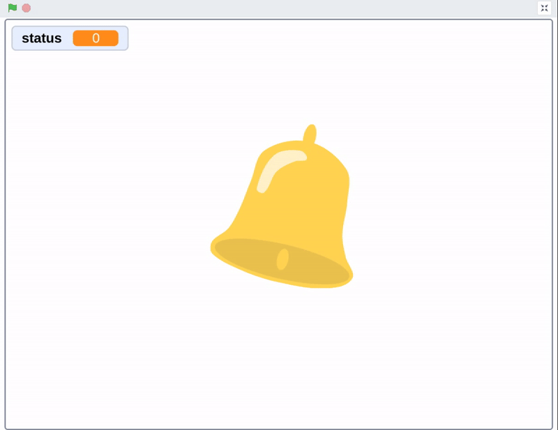
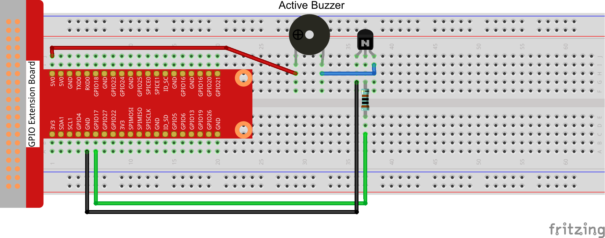
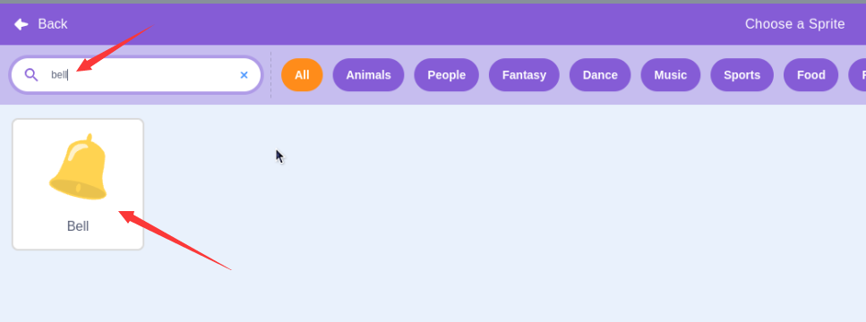
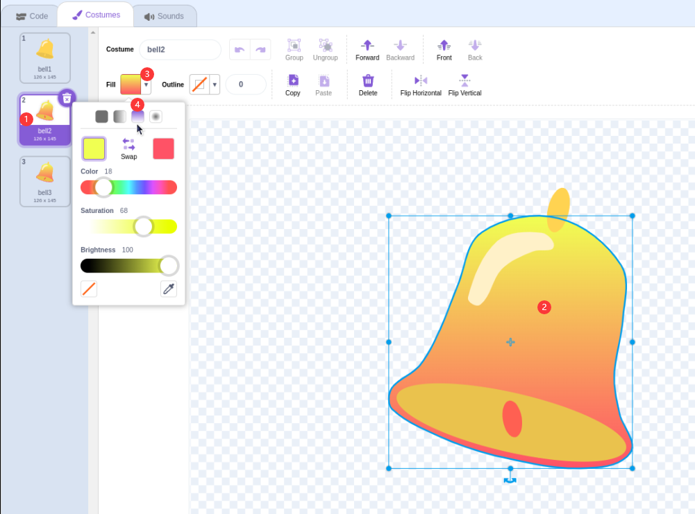
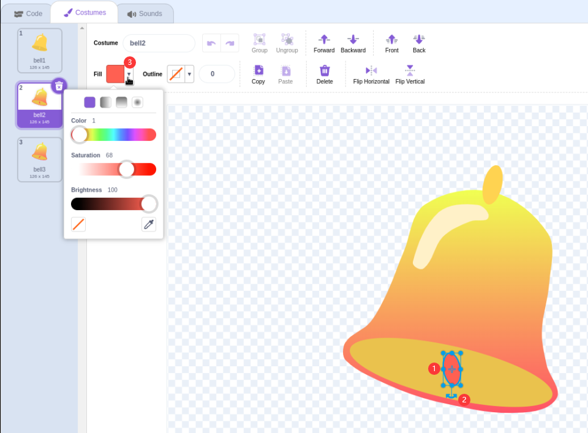
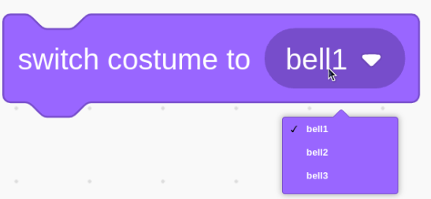
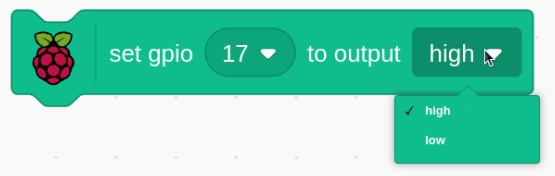
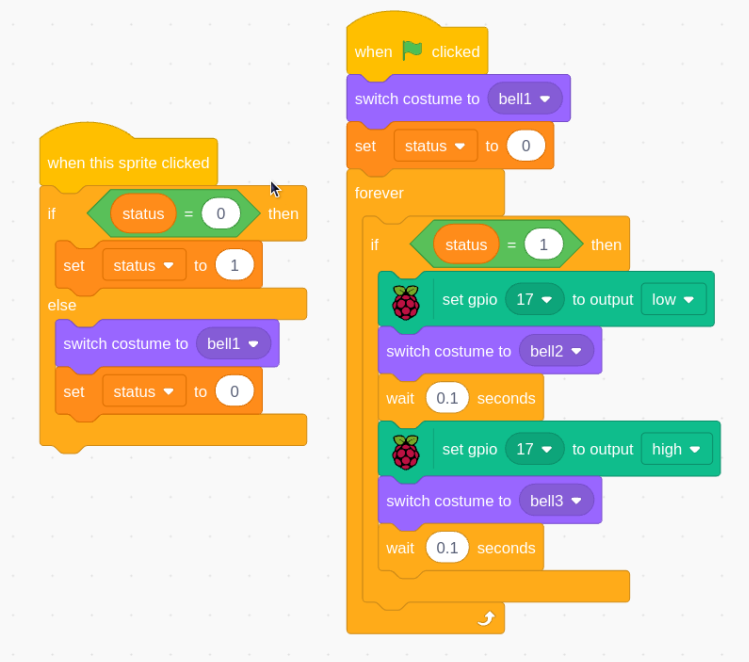

# 1.5 Doorbell

Today we will make a doorbell, click the bell sprite on the stage, the buzzer will sound; click again, the buzzer will stop sounding.

## Required Components

## Build the Circuit

## Load the Code and See What Happens

Load the code file (`1.5_doorbell.sb3`) to Scratch 3.上

Click on the green flag on the stage. When we click on the Button 3 sprite, it will turn blue and then the buzzer will sound; when we click again, the **Button3** sprite reverts to gray and the buzzer stops sounding.

## Tips on Sprite

Delete the default sprite, then choose the **Bell** sprite.

Duplicate two bell characters

Change the color of the bell2 sprite. Display the color when the doorbell is clicked

Adjust the direction of the bell sprites for bell2 and bell3 sprite.

## Tips on Codes

This block allows you to switch the sprite’s costume.

Set gpio17 to low to make the buzzer sound; set it to high and the buzzer will not sound.

When the bell sprite is clicked, the program outputs a high-low voltage cycle with a period of 0.1 seconds to the GPIO pin. This drives a buzzer to produce a sound.

At the same time, the program alternates between showing the bell2 sprite and the bell3 sprite. This creates a visual effect that accompanies the buzzer sound.

In summary, the program creates a doorbell-like experience, where clicking the bell sprite triggers both an audible and visual response. The GPIO output controls a buzzer to make a ringing sound, while the costume changes of the bell sprite provide visual feedback to the user.

This Scratch program demonstrates the use of input/output control, timing, and sprite animation to create a simple but interactive electronics project. It's a great example of how Scratch can be used for basic hardware interfacing and multimedia projects.
