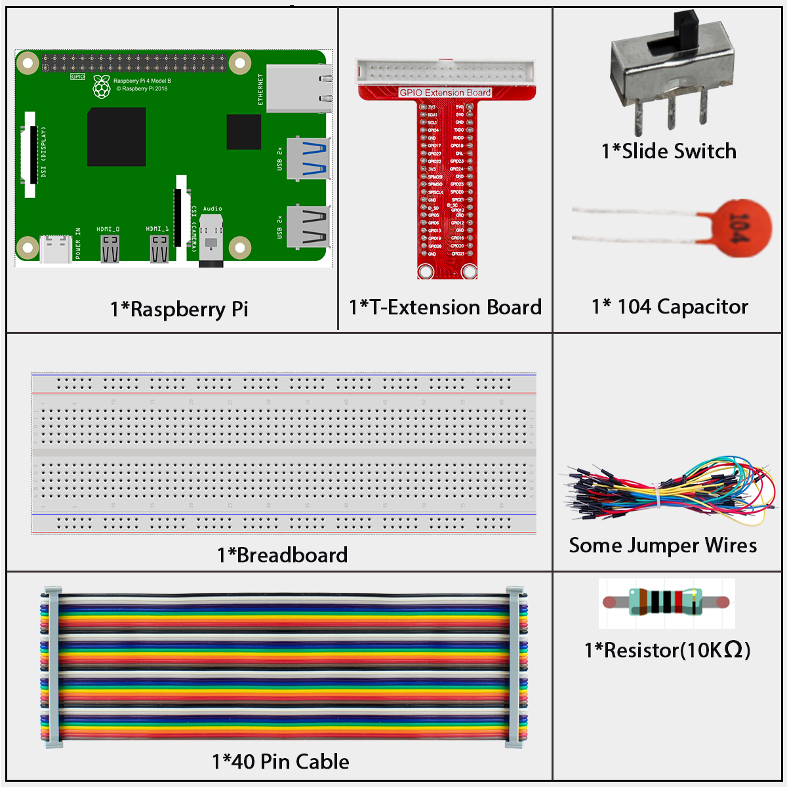
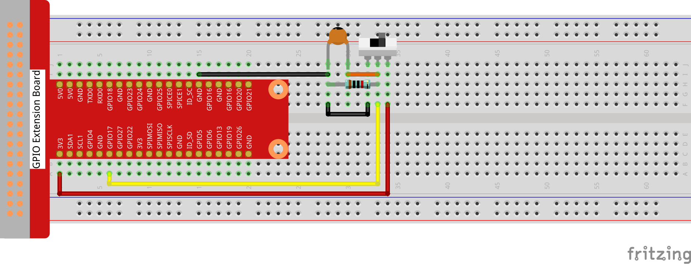
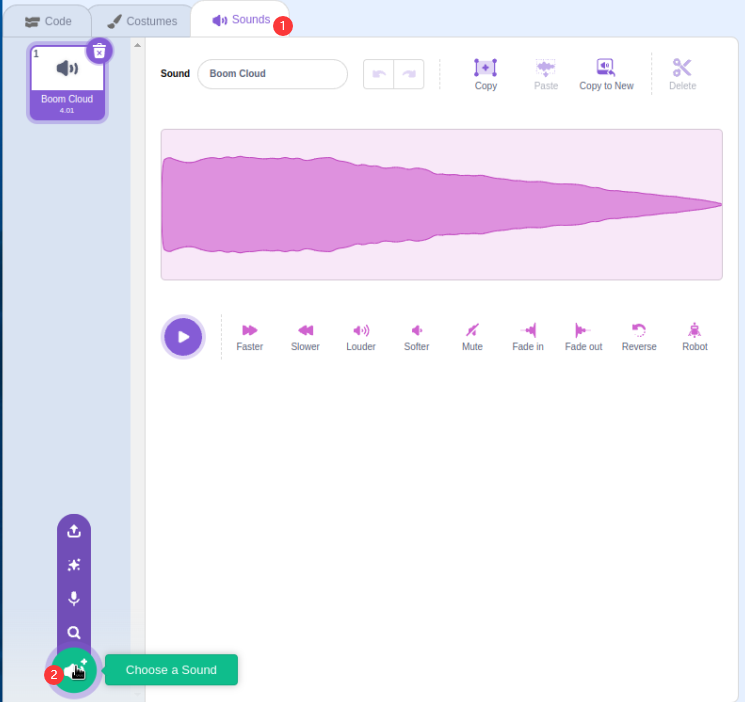
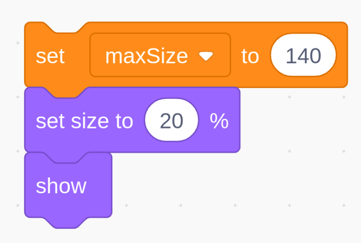
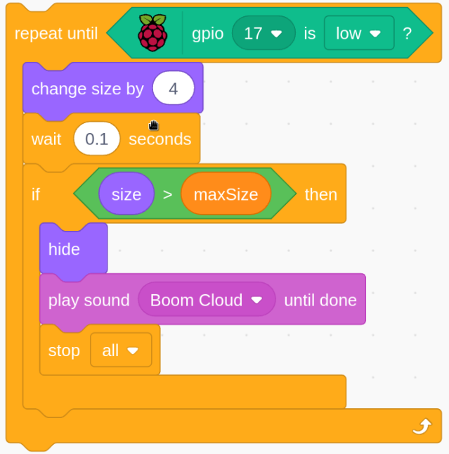
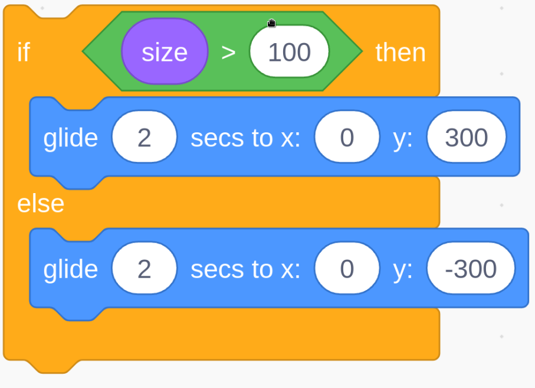

# 1.6 Inflating Balloon

Here, we will play a game of ballooning.

By toggling Slide to the right to start to inflate the balloon, at this time the balloon will get bigger and bigger. If the balloon is too large will blow up; if the balloon is too small, it will not float into the air. You need to judge when to toggle the switch to the right to stop pumping.

## Required Components

## Build the Circuit

## Load the Code and See What Happens

Load the code file (`1.6_inflating_balloon.sb3`) to Scratch 3.

By toggling Slider to the right to start to inflate the balloon, at this time the balloon will get bigger and bigger. If the balloon is too large will blow up; if the balloon is too small, it will not float into the air. You need to judge when to toggle the switch to the right to stop pumping.

## Tips on Sprite

Delete the previous Sprite1 sprite, then add the **Balloon1** sprite.

**A balloon explosion sound effect is used in this project, so let’s see how it was added.**

Click the **Sound** option at the top, then click **Choose a Sound.**

Type **boom** to search,choose **Boom Cloud**.

## Tips on Codes

Set the size threshold of the Ballon1 sprite to 140

Set the size of the Balloon1 sprite to 20 and show it in the stage area.

This is an event block, and the trigger condition is that gpio17 is high, that is, the switch is toggled to the left.

Move the coordinates of the Balloon1 sprite to (0,0), which is the center of the stage area.

**Set up a loop to inflate the balloon, this loop stops when the slider switch is toggled to the left.**

Within this loop, the balloon size is increased by 4 every 0.1s, and if it is larger than **maxSize**, the balloon will burst, at which point the boom sound is made and the code is exited.

After the last loop exits (Slider toggles to the left), determine the position of the Balloon1 sprite based on its size. If the size of the Balloon1 sprite is greater than 100, lift off (move the coordinates to (0, 300), otherwise land (move the coordinates to (0, -300).

