# 1.7 Flowing LED

Today, we will use LED, Raspberry Pi and scratch to make a Water Lamp.

The LED will light up in order with the direction of the arrows on the stage.

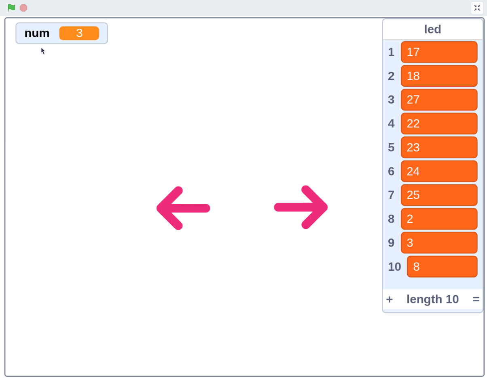

## Required Components

## Build the Circuit

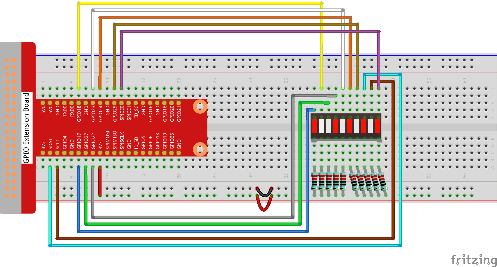

## Load the Code and See What Happens

By clicking on **Arrow1**, the LEDs  are lit in sequence from the left to the right (one at a time) and then off. Click **Arrow2** and the LEDs light up in the opposite order.

## Tips on Sprites

Delete the default sprite and choose the **Arrow1** sprite.

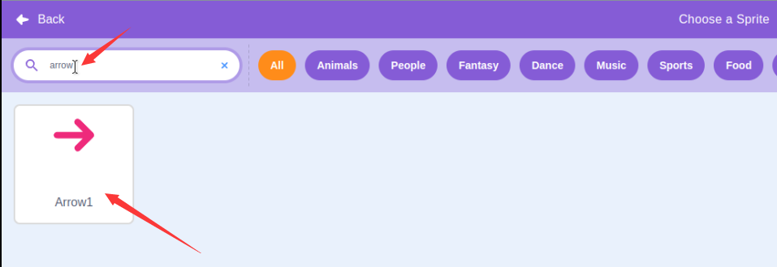

Here we will need 2 **Arrow1** sprites, which can be done with the duplicate button.

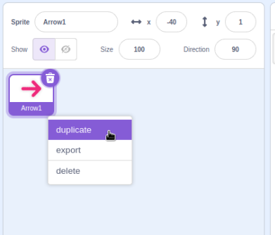

Click on the **Arrow 2** sprite and change the direction of the arrow by selecting arrow1-b.

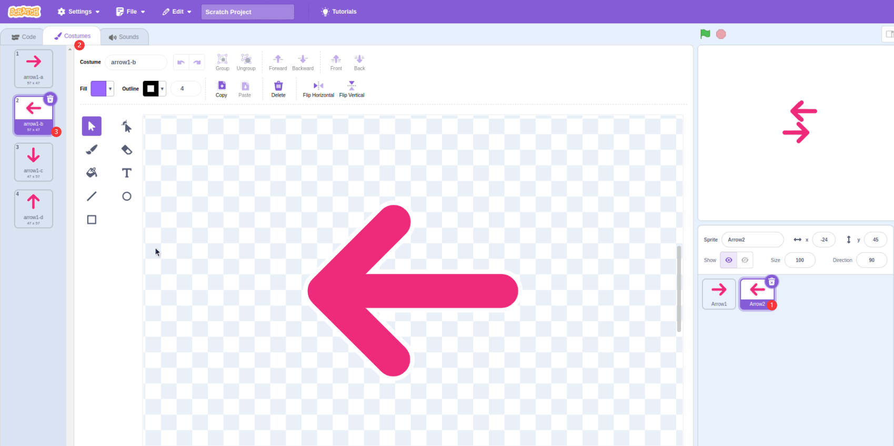

Now let’s make a variable.

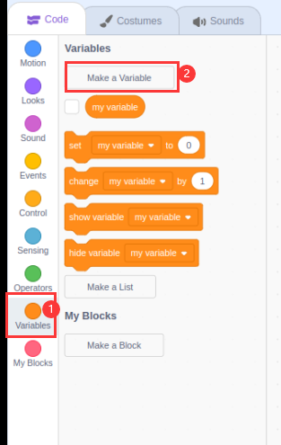

Name it as **num**.

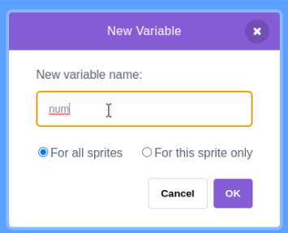

Follow the same method to create a list called **led**.

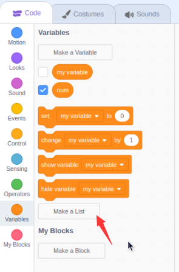

After adding, you should see the **num** variable and the **led** list on the stage area.

Click **+** to add 10 list items and enter the pin numbers in order (17,18,27,22,23,24,25,2,3,8).

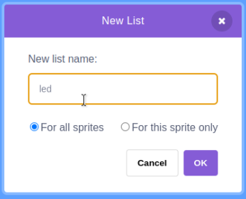 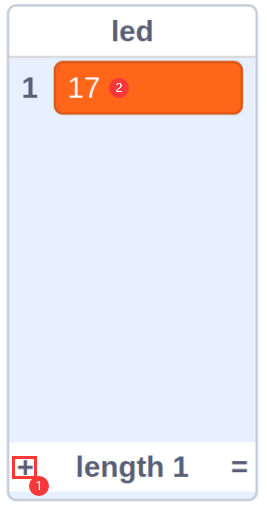 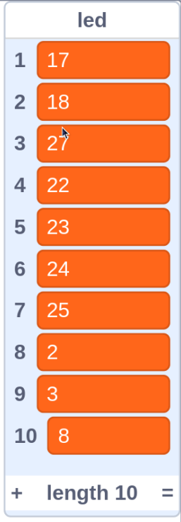

## Tips on Codes

This is an event block that is triggered when the current sprite is clicked.

The initial value of the **num** variable determines which LED is lit first.

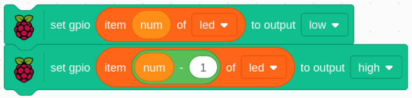

Set the pin corresponding to **num** in the led list to low to light the LED, and then set the pin corresponding to **num-1** to high to turn off the previous LED.
