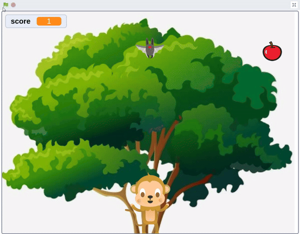
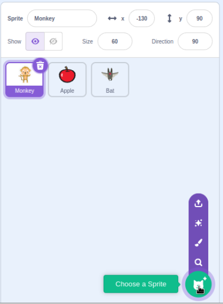
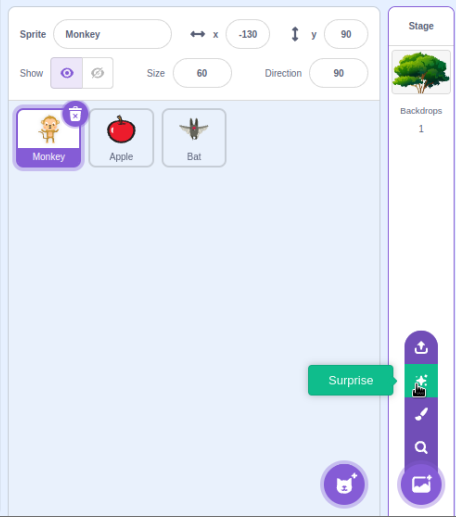
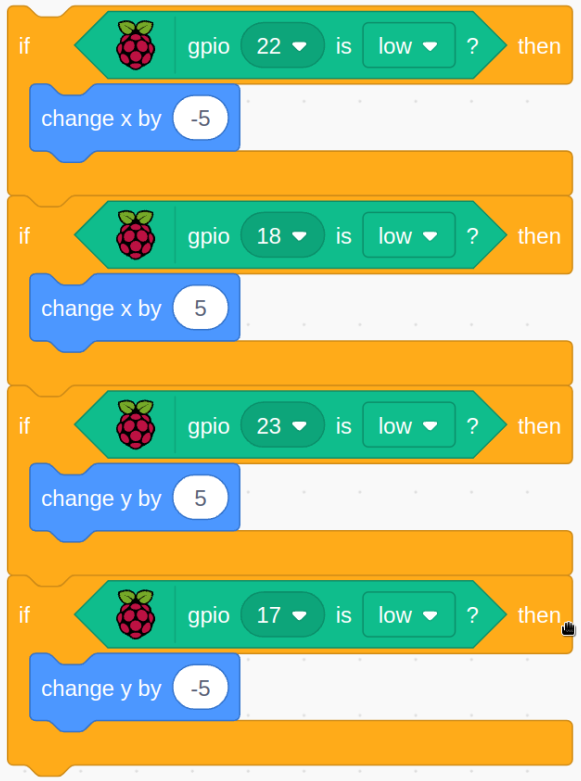
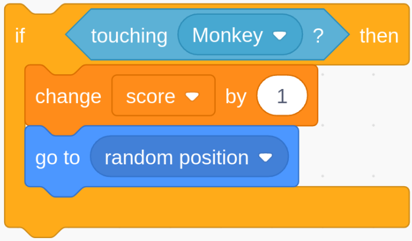
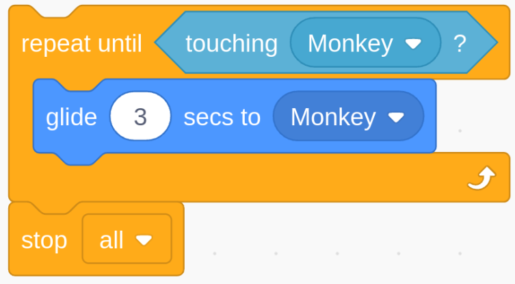

# 1.9 Monkey Pick Apple

Click the green flag to control the monkey to pick apple, while avoiding touching the bat.

## Required Components

In this project, we need the following components.

## Build the Circuit

## Load the Code and See What Happens

Load the code file (`1.9_monkey_pick_apple.sb3`) to Scratch 3.

Click on the green flag to start running the code. Use four keys to control the monkey's movement. When the monkey touches an apple, it earns points; when the monkey is caught by a bat, the game ends

## Tips on Sprite

Select the sprites "**Monkey**", "**Apple**", and "**Bat**".

## Tips on Stage

Upload Backdrop or Surprise a Backdrop

## Tips on Codes

Sprite Monkey code. When the button is pressed, the **Monkey** Sprite changes 5 units in the corresponding direction position

Apple sprite code. When Apple Sprite was touched by monkey Sprite. The score is increased by 1. You can modify the score you get.

Bat sprite code. Bat Sprite caught up with Monkey Sprite in 3 seconds. You can modify this time parameter. Modify the difficulty of the game.

