# Quick Guide on Scratch

Note

When working with Scratch 3, having a screen can enhance your experience. However, if you don't have access to a screen, you can still utilize **VNC** to remotely access the Raspberry Pi desktop. For a comprehensive guide, please refer to [VNC](../appendix/remote_desktop.rst).

***Furthermore, Scratch 3 requires a minimum of 1GB of RAM to run smoothly. For optimal performance, we recommend using a Raspberry Pi 4 with at least 2GB of RAM. Although Scratch 3 can run on Raspberry Pi 2, 3, 3B+, or a Raspberry Pi 4 with 1GB of RAM, performance may be compromised, especially when running other software simultaneously. In some cases, Scratch 3 may fail to start due to insufficient memory.***

## Install Scratch 3

When [installing Raspberry Pi Operating System](../preparation/Installing_the_OS_(Common).md), you have to choose the version with desktop, either with desktop only or with desktop and recommended software.

If you install the version with the recommended software, you can see Scratch 3 in the system menu at **Programming**.

If you installed the desktop-only version, you will need to install Scratch 3 manually, as described below.

Open up the menu, click on **Preferences** -> **Recommended Software**.

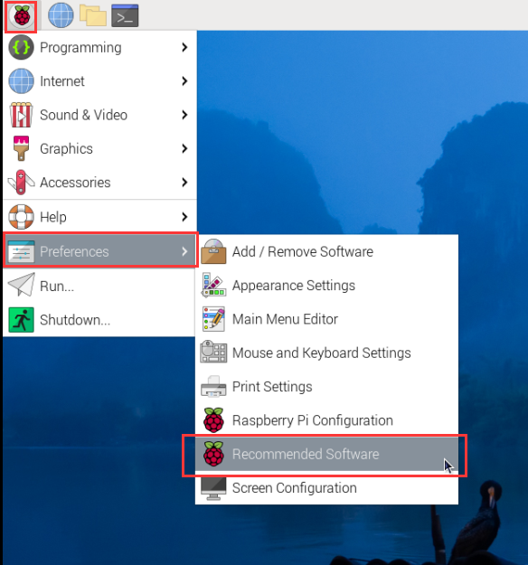

Find scratch 3 and check it, then click **Apply** and finally wait for the installation to finish.

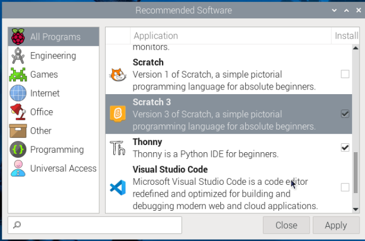

Once the installation is complete, you should see it on the **Programming** in the system menu.

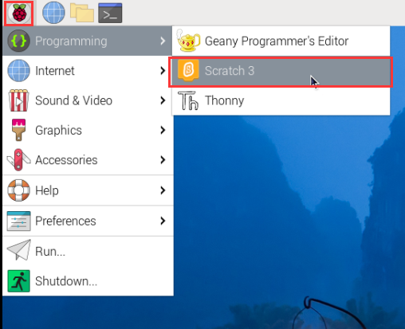

## About Scratch 3’s Interface

Scratch 3 is designed with the intention of being enjoyable, educational, and straightforward to grasp. It offers a range of tools for crafting interactive stories, games, artwork, simulations, and more, all through block-based programming. Scratch also includes its own built-in paint editor and sound editor.

At the top of Scratch 3, there are several basic options. The first, from left to right, is the language option, enabling users to select different programming languages. The second is the **File** option, allowing users to create new files, read local files, and save current files. The third option is **Edit**, providing functions such as undoing deletions and activating acceleration mode, which speeds up sprite movement. Next is the **Tutorials** option, providing access to project tutorials. Finally, there's the file naming option, enabling users to rename their projects.

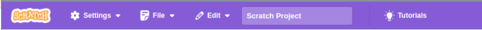

**Code**

It has three main sections: a stage area, block palette, and coding area. Programming by clicking and dragging the block on the block palette to the coding area, and finally your programming results will be displayed on the stage area.

Here is the sprites area of Scratch 3. Above the area are the basic parameters of the sprites, you can add sprites that come with Scratch 3 or upload local sprites.

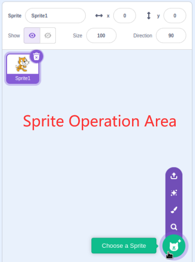

Here is the Scratch 3 backdrop area, mainly to add a suitable backdrop for your stage, you can add the backdrop that comes with Scratch 3 or upload a local one.

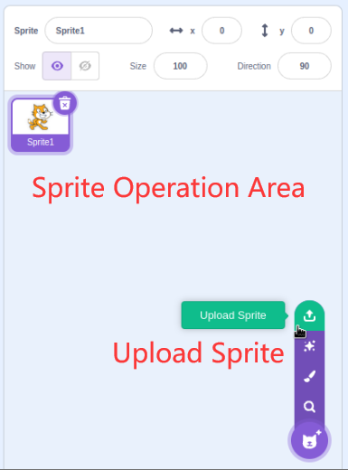

This is a **Add Extension** button.

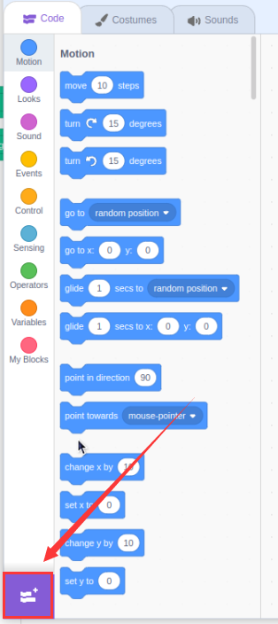

In Scratch 3, we can add all kinds of useful extensions, here we take **Raspberry Pi GPIO** as an example and click on it.

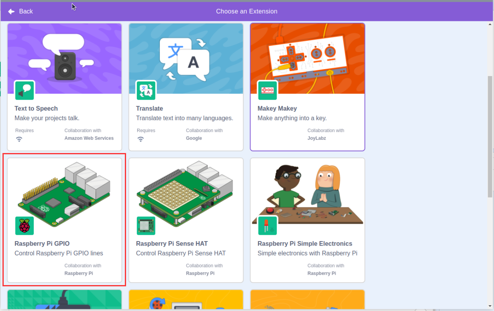

You will see it on the block palette and you can use the functions associated with this extension. If you have a camera connected, you will see the camera screen on the stage area.

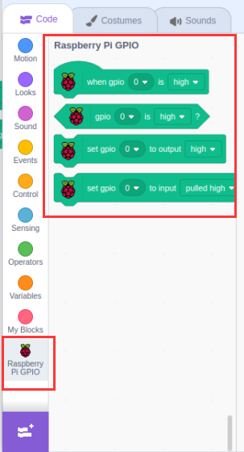

**Costumes**

Click on the **Costumes** button located in the top left corner to access the costumes palette. Each costume enables sprites to display distinct static movements. When these static movements are combined, they create a cohesive dynamic motion.

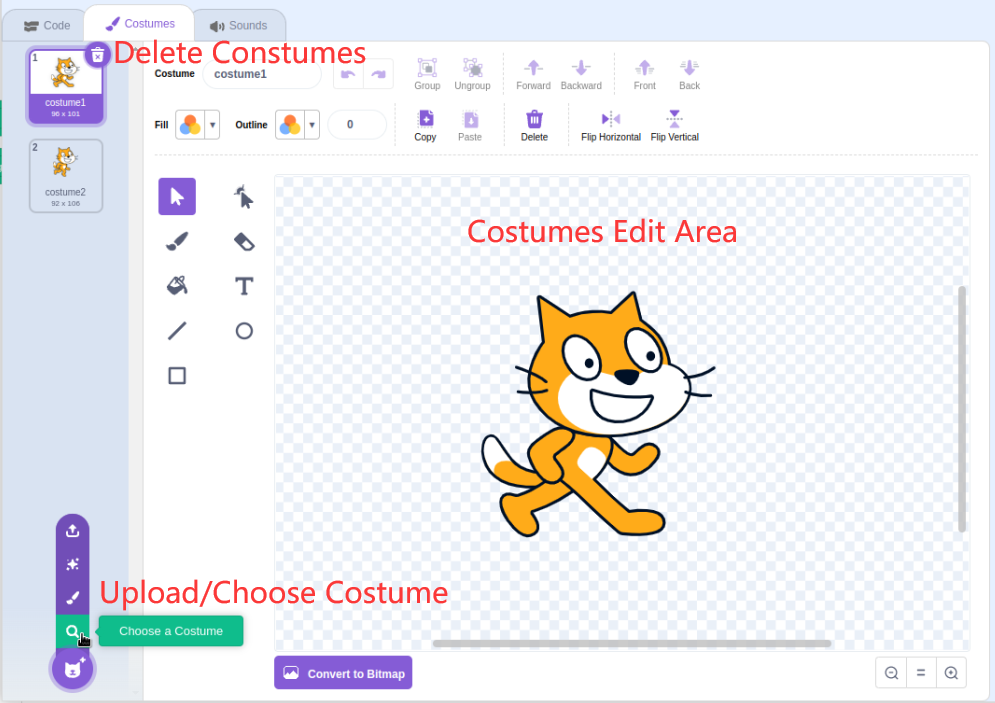

**Sounds**

To make your experiments more engaging, you might want to incorporate some music clips. Click on the **Sounds** button in the top left corner where you can edit the current sound or choose/upload a new one.

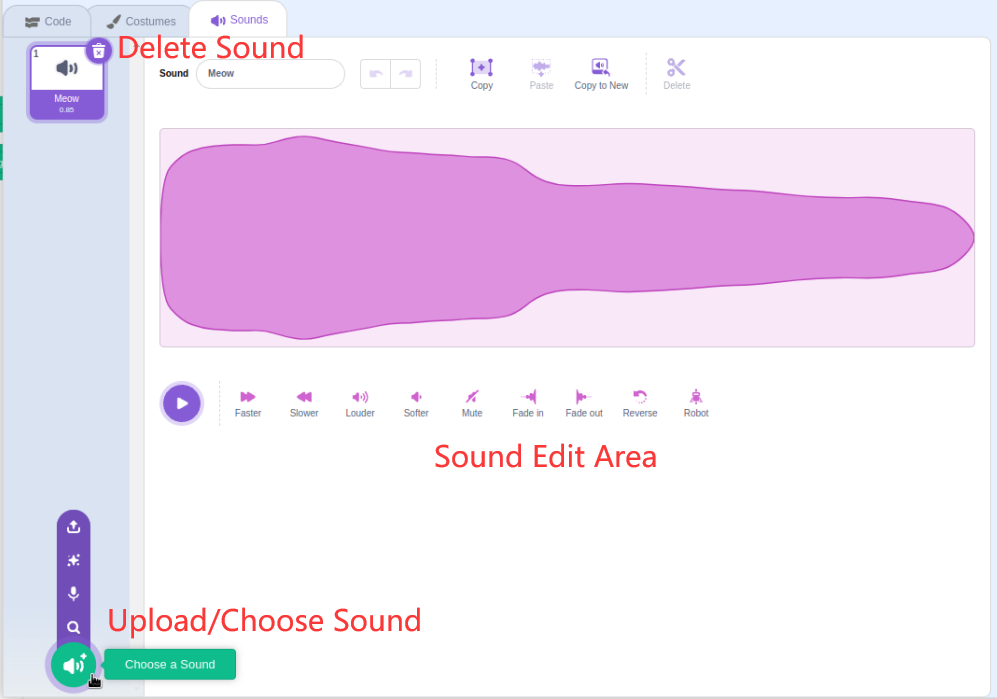